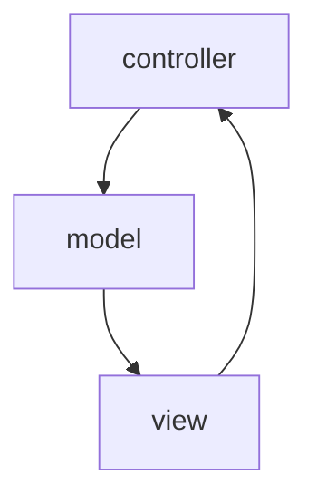

##一、基础部分

#####1、Java面向对象基本特征：封装、继承、抽象、多态
封装：将变化隔离、便于使用、提高重用性、提高安全性
继承：提高代码复用性
抽象：一类实体的共同特征
多态：需要三个条件。要有继承、要有重写、父类引用指向子类对象（向上转型）

#####2、封装和抽象：
抽象关注对象的行为；封装关注对象行为的细节

#####3、JDK和JRE
JDK是Java开发工具包、JRE是Java运行环境

#####4、Java基本数据类型
byte、short、int、long、float、double、boolean、char

#####5、重载和重写
- 重载：发生在同一个类中，方法名必须相同，参数类型不同、个数不同、顺序不同，方法返回值和访问修饰符可以不同，发生在编译时。
- 重写：发生在父子类中，方法名、参数列表必须相同，返回值小于等于父类，抛出的异常小于等于父类，访问修饰符大于等于父类；如果父类方法访问修饰符为private则子类中就不是重写。

#####6、构造器Constructor是否可被重写override
构造器不能被重写、不能用static修饰，只能用public、private和protect这三个权限修饰符，且不能有返回语句

#####7、Java支持多继承么
不支持，每个类只能继承一个类，但是可以实现多个接口

#####8、各个访问控制符的区别
public：在任何地方都能访问；
private：只有在本类中才能访问；
protected：在同包内的类及包外的子类能访问；
默认不写在同包内能访问。

#####9、接口和抽象类的区别
抽象层次不同，抽象类是对类抽象，而接口是对行为的抽象。
接口中的所有方法隐含的都是抽象的；而抽象类则可以同时包含抽象和非抽象方法。
接口的成员函数默认都是public的。
另：接口可继承接口（并且可以写实现，Java8特性，转成default方法）；抽象类可以实现接口；抽象类可以继承接口

#####10、值传递和引用传递
对象被值传递，意味着传递了对象的一个副本。因此，就算是改变了对象副本，也不会影响源对象的值。
对象被引用传递，意味着传递的并不是实际的对象，而是对象的引用。因此，外部对引用对象所做的改变会反映到所有的对象上。

#####11、String和StringBuffer、StringBuilder的区别
- String对象不可变，其他两个可变。String类中使用字符数组保存字符串，private final char value[]，所以string对象是不可变的。StringBuilder与StringBuffer都继承自AbstractStringBuilder类，在AbstractStringBuilder中也是使用字符数组保存字符串，char[] value，这两种对象都是可变的。

- 线程安全性：String和StringBuffer是线程安全的，StringBuilder是非线程安全
单线程操作字符串缓冲区下操作大量数据StringBuilder
多线程操作字符串缓冲区下操作大量数据StringBuffer

##### 12、hashCode和equals方法的关系
equals相等，hashCode必相等；hashCode相等，equals可能不相等

##### 13、什么是Java序列化，如何实现Java序列化
序列化就是将对象转换成字节流（二进制）。实现Serializable接口或者实现Externalizable接口。

#####14、&和&&的区别
&是位运算符，表示按位与运算，&&是逻辑运算符，表示逻辑与
if(exp1 & exp2){} 中exp1和exp2无论哪种情况都执行
if(exp1 & exp2){} 中如果exp1返回false那么exp2不执行，如果exp1返回true，那么exp2执行

#####15、Unicode是用多少位表示一个字的，Unicode和UTF-8有什么区别，UTF-8mb4和UTF-8有什么区别
16位（即2个字节，对于英文字符，其实只占用1个字节，浪费了1个字节）

Unicode包含UTF-8，UTF-8 是一种 Unicode 字符集的编码方式。UTF-8指能用ASCII编码的字符用ASCII编码，其它字符均用Unicode编码，每个字符大小可变。一般UTF-8用于标记语言（比如XML之类），所以不用担心高低字节的问题。

utf8mb4是一种可支持4个字节UTF编码，一个字符最多能有4字节。utf8mb4兼容utf8，且比utf8能表示更多的字符。（Mysql相关：Mysql的utf8编码最多3个字节，采用utf8mb4字符编码可以用来存emoj表情）

#####16、在Web应用开发过程中经常遇到输出某种编码的字符，如iso8859-1，如何输出一个某种编码的字符串

```java
public String translate (String str) {
    String tempStr = “”;
    try {
        tempStr = new String(str.getBytes(“ISO-8859-1″), “GBK”);
        tempStr = tempStr.trim();
    }catch (Exception e) {
    	System.err.println(e.getMessage());
    }
    return tempStr;
}
```

#####17、Java堆栈的区别
Java把内存划分成两种：一种是栈内存，一种是堆内存。

- 在函数中定义的一些基本类型的变量和对象的引用变量都在函数的栈内存中分配。
- 堆内存用来存放由new创建的对象和数组。在堆中分配的内存，由Java虚拟机的自动垃圾回收器来管理。

例如：String str = new String（）；引用变量str在栈内存，并指向堆内存中的new String的内存地址

#####18、final和static
- final修饰的变量表示常量，初始化值后不能再修改；final方法不能被子类重写但能继承；final类不能被继承，没有子类；final不能用于修饰构造方法
- static可修饰变量、方法或者内部类，被static修饰的代码块在类加载时进行初始化
- final static用来修饰成员变量和方法，此时变量为全局变量

#####19、自动装箱和拆箱
装箱：将基本类型用它们对应的引用类型包装起来
拆箱：将包装类型装换为基本数据类型

#####20、什么是泛型、泛型擦除
泛型即“参数化类型”。在集合中，创建集合指定集合元素类型，该集合只能保存其指定类型的元素，避免使用强制类型转换。
Java编译器生成的字节码是不包涵泛型信息的，泛型类型信息将在编译处理是被擦除，这个过程即类型擦除。泛型擦除可以简单的理解为将泛型java代码转换为普通java代码，只不过编译器更直接点，将泛型java代码直接转换成普通java字节码。
类型擦除的主要过程如下：
- 将所有的泛型参数用其最左边界（最顶级的父类型）类型替换。
- 移除所有的类型参数。

#####21、Error、Exception区别
Error和Exception类的父类都是throwable类，区别是:
- Error类一般是指与虚拟机相关的问题，如系统崩溃，虚拟机错误，内存空间不足，方法调用栈溢等。对于这类错误的导致的应用程序中断，仅靠程序本身无法恢复和和预防，遇到这样的错误，建议让程序终止。
- Exception类表示程序可以处理的异常，可以捕获且可能恢复。遇到这类异常，应该尽可能处理异常，使程序恢复运行，而不应该随意终止异常。

#####22、Java类加载顺序
JAVA类首次装入时，会对静态成员变量或方法进行一次初始化,但方法不被调用是不会执行的， 静态成员变量和静态初始化块级别相同，非静态成员变量和非静态初始化块级别相同。

先初始化父类的静态代码--->初始化子类的静态代码-->初始化父类的非静态代码--->初始化父类构造函数--->初始化子类非静态代码--->初始化子类构造函数


##二、集合部分
#####1、集合基本类
List和Set继承自Collection接口。
- List有序且允许元素重复。ArrayList、LinkedList和Vector是三个主要的实现类。
- Set无序不允许元素重复。HashSet和TreeSet是两个主要的实现类。

Map接口也属于集合系统，key不能重复，否则会被覆盖，但是value可以重复。HashMap、TreeMap和Hashtable是三个主要的实现类。SortedSet和SortedMap接口对元素按指定规则排序，SortedMap是对key列进行排序。

#####2、HashMap和HashTable的区别
HashMap：继承于AbstractMap，key、value都可以为null，非线程安全；
Hashtable：继承于Dictionary，key、value都不可以为null，线程安全。

#####3、什么是迭代器(Iterator)
Iterator接口提供了很多对集合元素进行迭代的方法。每一个集合类都包含了可以返回迭代器实例的迭代方法。迭代器可以在迭代的过程中删除底层集合的元素（例如ArrayList的遍历过程中删除不能使用简单的for循环而应该用迭代器）。

#####4、数组(Array)和列表(ArrayList)有什么区别
Array可以包含基本类型和对象类型，ArrayList只能包含对象类型。
Array大小是固定的，ArrayList的大小是动态变化的。
ArrayList提供了更多的方法和特性，比如：addAll()，removeAll()，iterator()等等。

#####5、ArrayList和LinkedList有什么区别
ArrayList是实现了基于动态数组的数据结构，LinkedList基于链表的数据结构。
对于随机访问get和set，ArrayList觉得优于LinkedList，因为LinkedList要移动指针
对于新增和删除操作add和remove，LinedList比较占优势，因为ArrayList要移动数据

##三、多线程
#####1、多线程的实现方式
继承Thread类；
实现Runnable接口；
使用ExecutorService、Callable、Future实现有返回结果的多线程。

####2、什么是线程安全
线程安全就是多线程访问同一代码，不会产生不确定的结果。

#####3、如何保证线程安全
对非安全的代码进行加锁控制（synchronized）；
使用线程安全的类；
多线程并发的情况下，线程共享的变量改为方法级的局部变量

#####4、sleep和wait的区别
sleep()方法是Thread类中方法，而wait()方法是Object类中的方法。
调用sleep()方法过程中不会释放对象锁；
而当调用wait()方法的时候，线程会放弃对象锁，调用notify()方法后本线程才进入对象锁定池准备。

#####5、当一个线程进入一个对象的一个synchronized方法后，其它线程是否可进入此对象的其它方法?
可以进入其他非synchronized的方法，synchronized的方法不可以的。

#####6、线程同步
- synchronized 关键字修饰方法、代码块
- 使用volatile特殊域变量实现线程同步
- 使用重入锁实现线程同步 (java.util.concurrent包,ReentrantLock类)
- 使用ThreadLocal局部变量实现线程同步
- 使用阻塞队列实现线程同步 (java.util.concurrent包,LinkedBlockingQueue 类)
- 使用原子变量实现线程同步 (util.concurrent.atomic包,AtomicInteger类)

##四、JVM知识
#####1、JVM基本结构
- 虚拟机栈（栈，存储栈帧）
- 堆
- 方法区
- 本地方法栈
- 程序计数器

#####2、Java堆栈区别

“所有局部变量存放在栈中，所有对象存堆中”
- 局部变量如果是基本类型，则存栈中；如果是对象类型，实际上操作的是一个引用，引用存栈中，对象存堆中。
- 对象存堆中的含义就是对象的所有字段存堆中，所以对象的字段不管是基本数据类型和引用一律在堆中，引用指向的对象自然也在堆中。

#####2、Java中垃圾回收有什么目的？什么时候进行垃圾回收？
垃圾回收的目的是识别并且丢弃应用不再使用的对象来释放和重用资源。

#####3、System.gc()和Runtime.gc()会做什么事情
这两个方法用来提示JVM要进行垃圾回收。但立即开始还是延迟进行垃圾回收是取决与JVM的。

#####4、如果对象的引用被置为null，垃圾收集器是否会立即释放占用内存
不会，在下一次垃圾回收周期中，这个对象是可被回收的

#####5、如何强制垃圾回收一个对象？
垃圾回收不能被强制执行。可以调用System.gc()，但JVM不保证马上执行垃圾回收动作。

#####6、GC基本算法
引用计数、复制、标记-清扫、标记-压缩、分代

#####7、内存泄漏定位
使用命令或工具


##五、IO流
#####1、BIO、NIO、AIO的区别，NIO的使用场景
BIO 同步阻塞式IO
NIO 同步非阻塞式IO（jdk1.4特性），服务器实现模式为一个请求一个线程，即客户端发送的连接请求都会注册到多路复用器上，多路复用器轮询到连接有I/O请求时才启动一个线程进行处理；

AIO 异步非阻塞IO（jdk1.7特性），服务器实现模式为一个有效请求一个线程，客户端的I/O请求都是由OS先完成了再通知服务器应用去启动线程进行处理

> NIO适用于数量多的短连接架构（如聊天服务器）；AIO适用于数量多的长连接（如相册服务器）


##六、Web框架
#####1、什么是MVC，你的理解
MVC是一种设计模式，分为三个部分：
- 视图（view）：用户界面
- 控制器（controller）：业务逻辑
- 模型（model）：数据保存


1. View 传送指令到 Controller
2. Controller 完成业务逻辑后，要求 Model 改变状态
3. Model 将新的数据发送到 View，用户得到反馈

参考http://www.ruanyifeng.com/blog/2015/02/mvcmvp_mvvm.html

#####2、什么是Spring IOC和AOP，DI又是什么
IOC：控制反转，IOC容器控制对象之间的依赖关系，解耦
AOP：面向切面编程，允许你把遍布应用各处的功能分离出来形成可重用的组件。
DI: 依赖注入。IOC主要的实现方式有两种：依赖查找和依赖注入

#####3、Spring中的BeanFactory与ApplicationContext的作用和区别？
BeanFactory负责读取bean配置文档，管理bean的加载，实例化，维护bean之间的依赖关系，负责bean的声明周期。
ApplicationContext除了提供上述BeanFactory所能提供的功能之外，还提供了更完整的框架功能:国际化支持、 资源访问和事件传递。

#####4、简述一下Hibernate的SessionFactory，创建的方法
SessionFactory接口负责初始化Hibernate。它充当数据存储源的代理，并负责创建Session对象。
一般通过Configuration读取配置文件生成Configuration对象来创建SessionFactory。

#####5、Hibernate一级缓存、二级缓存和查询缓存区别

##七、前端知识
#####1、简述Ajax原理，XMLHttpRequest对象是什么，它有哪些属性方法
Ajax的原理简单来说是通过XMLHttpRequest对象向服务器发异步请求，从服务器获得数据，然后使用javascript来操作DOM而更新页面。

XMLHttpRequest属性有readyState（对象状态）、Onreadystatechange、responseText、responseXML、Status、statusText；方法有open、send、SetRequestHeader、getAllResponseHeaders、getResponseHeader、Abort。

状态有四种。

#####2、JQuery的

##八、数据库
#####1、mysql数据库常用引擎
MyIsam 不支持事务，不支持外键，select操作较好
innoDB 支持事务，支持外键，insert和update操作比较好

#####2、数据库优化

- 恰当使用索引
- 对查询进行优化，尽量避免全表扫描。不要在列上进行运算；不使用 NOT IN 和 <> 操作。NOT IN可以NOT EXISTS代替，id<>3则可使用id>3 or id< 3来代替。还有其他等等许多
- 持久层缓存，例如hibernate默认使用的二级缓存就是ehcache
- 表的拆分
- 字段冗余（一般是不变的字段）

还有许多.......
参考 http://www.jianshu.com/p/fea61b518dc4

#####3、乐观锁和悲观锁
	在关系数据库管理系统里，都是并发控制的方法。
- 悲观锁：指的是对数据被外界（包括本系统当前的其他事务，以及来自外部系统的事务处理）修改持保守态度(悲观)，因此，在整个数据处理过程中，将数据处于锁定状态。会产生死锁。
悲观锁的实现，往往依靠数据库提供的锁机制。
- 乐观锁：相对悲观锁而言，乐观锁假设认为数据一般情况下不会造成冲突，所以在数据进行提交更新的时候，才会正式对数据的冲突与否进行检测，如果发现冲突了，则让返回用户错误的信息，让用户决定如何去做。乐观锁不会产生任何锁和死锁。
一般实现方式就是记录数据版本，实现数据版本一是使用版本号，二是使用时间戳

>乐观锁适用于写比较少的情况下，即冲突真的很少发生的时候，这样可以省去了锁的开销，加大了系统的整个吞吐量。但如果经常产生冲突，上层应用会不断的进行retry，这样反倒是降低了性能，所以这种情况下用悲观锁就比较合适。

##九、数据结构和算法
常用数据结构有 线性表、线性链表、栈、队列、串、数组、广义表、树和二叉树

#####1、各种排序算法的对比


#####2、快速排序
请看维基，手写快排
https://zh.wikipedia.org/wiki/%E5%BF%AB%E9%80%9F%E6%8E%92%E5%BA%8F

```java
public class QuickSort {

    int[] arr = {3, 7, 8, 5, 2, 1, 9, 5, 4};

    private void swap(int x, int y) {
        int temp = arr[x];
        arr[x] = arr[y];
        arr[y] = temp;
    }

    private void quick_sort_recursive(int start, int end) {
        if (start >= end){
            return;
        }
            
        int mid = arr[end];
        int left = start, right = end - 1;
        while (left < right) {
            while (arr[left] <= mid && left < right)
                left++;
            while (arr[right] >= mid && left < right)
                right--;
            swap(left, right);
        }
        if (arr[left] >= arr[end])
            swap(left, end);
        else
            left++;
        quick_sort_recursive(start, left - 1);
        quick_sort_recursive(left, end);
    }

    public void sort() {
        quick_sort_recursive(0, arr.length - 1);
    }
    
    public static void main(String[] args) {
        QuickSort qq = new QuickSort();
        //qq.arr = {3, 7, 8, 5, 2, 1, 9, 5, 4};
        qq.sort();
        System.out.println(Arrays.toString(qq.arr));
        //System.out.println(Arrays.toString(qq.arr));
    }
}
```

排序----

```java
public class Sorting {

	private int arr[] = {2, 5, 4, 3, 1};
	
	/**
	 * @desc 冒泡排序
	 * 		 从第i位开始到len-i-1位，相邻比较，大数往后移动
	 * 		 第一次遍历将最大放到最后，第二次将倒数第二大放到倒数第二位置
	 * 		 最大或最小元素会慢慢“冒”到数列顶端（取决遍历判断方式）
	 * @date 2017年5月3日
	 */
	@Test
	public void bubble() {
		int len = arr.length, temp;
		System.out.println(len);
		//len=10  i=0 j=0-9  i=1 j=0-8 交换大值
		for(int i=0; i<len-1; i++){
			System.out.println(len-1-i);
			for(int j=0; j<len-1-i; j++){
				if(arr[j] > arr[j+1]){
					temp = arr[j];
					arr[j] = arr[j+1];
					arr[j+1] = temp;
				}
				System.out.println("arr-->"+Arrays.toString(arr));
			}
		}
		System.out.println(Arrays.toString(arr));
	}
	
	//{2, 5, 1, 3, 4}
	//1 5 2 3 4 
	//1  2534  
	/**
	 * @desc 选择排序
	 * 		 从第i位开始，相邻比较，找到剩下元素最小是哪一个，与i位值交换
	 * @date 2017年5月3日
	 */
	@Test
	public void select(){
		int len = arr.length, temp, j, min;
		for(int i=0; i<len-1; i++){
			min = i;
			for(j=i+1; j<len; j++){
				if(arr[min] > arr[j]){
					min = j;//最小值的元素位值
				}
			}
			//与i位置值交换
			temp = arr[min];
			arr[min] = arr[i];
			arr[i] = temp;
		}
	}
	
	/**{2, 5, 4, 3, 1}
	 * @desc 插入排序
	 * @date 2017年5月3日
	 */
	@Test
	public void insert() {
		int len=arr.length, temp;
		for(int i=0; i<len-1; i++){
			//System.out.println(i+1);
			//System.out.println("-->"+arr[i+1]);
			for(int j=i+1; j>0; j--){
				if(arr[j-1] < arr[j]){
					break;
				}
				temp = arr[j];
	            arr[j] = arr[j-1];
	            arr[j-1] = temp;
	            System.out.println("==>"+Arrays.toString(arr));
			}
		}
		System.out.println(Arrays.toString(arr));
	}
	
}
```

<br>
<a href="/Java面试题资料.md">md源文件链接，浏览器打开保存</a>
<br>
<div style="float:right">by shen</div>


