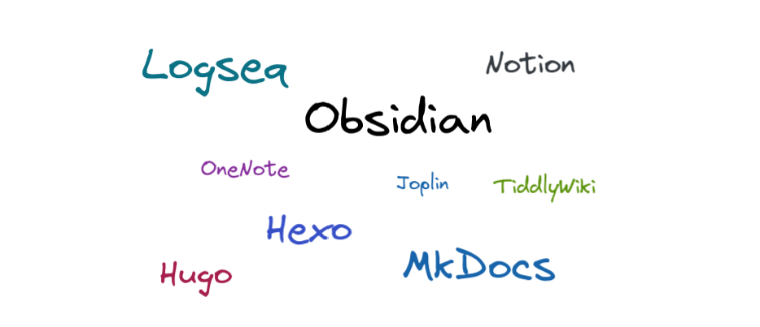

开发人员在职业生涯会学习许多技术和技能，随着知识积累越多，复杂度越大，就容易觉得知识体系很混乱。所以就需要我们做笔记，构建自己的知识体系，而且由于各种编程语言和技术之间本身也有共通的地方，做好归纳和关联更有利于我们快速。学习新的技术。

现在网络上有许许多多的笔记应用和管理工具，相关的讨论也非常多，在v2ex搜索笔记应用的帖子多达[六千条记录](https://www.google.com/search?q=site:v2ex.com/t%20%E7%AC%94%E8%AE%B0%E5%BA%94%E7%94%A8),网友们分享了许多的笔记应用和他们各自的知识管理方法，但总结起来大家在意的无非就是功能、隐私和安全三个方面，下面展开说说。

### 各类笔记应用的比较

做笔记，可以简单地用一个txt文件写，也可以厂商提供的web服务或者应用写，还可以用开源的可私有化部署的笔记应用写。

#### 树形 or 网状
各类笔记应用提供的功能也有所不同，一般对于开发人员，更喜欢 Markdown 这样的轻量级标记语言，语法简单，贴代码方便，所以大多笔记应用都支持 Markdown。传统的笔记都是用树形结构（或者说层级）管理，近几年大纲（卡片式）双链（或者说[反向链接](https://zh.wikipedia.org/zh-cn/%E5%8F%8D%E5%90%91%E9%93%BE%E6%8E%A5)）笔记开始火了起来，比如 Workflowy、Roam Reseach 和新出的 Logseq 等等。大纲可以转换成脑图，而双链则允许我们在笔记中互相引用其他笔记，整个笔记库形成一个网状的结构，知识之间是互相关联的。双链要求我们要求更强的整合和组织能力，我自己用不惯，个人还是更喜欢树形这样简单的结构。

#### 在线 SaaS or 本地私有化部署

一款笔记应用，我们除了关注本身的功能外，注意的点还有隐私和安全。

纯在线或托管在官方服务意味着隐私和安全都难以保证，在线应用需要你注册账号，在国内的应用还必须提供手机号，平台一般都会有一些审查，并且在线服务一旦出现故障或者自己本地没有网络都用不了。优点则是不需要自己操心，上手就用，比如  Notion 这样 all-in-one 的笔记应用，不仅有笔记的功能，还可以管理日程，还有团队协作。

对比在线应用我更喜欢数据存储在本地的应用，比如 Joplin 和 Obsidian 等，数据同步则由自己解决，比如 Joplin 可以私有化部署， Obsidian 可以用插件同步到云。 

这里列举一下常见的一些笔记应用：

- 传统的笔记应用：Notion、印象、有道、OneNote（不支持Markdown）和为知笔记等。
- 大纲双链笔记：Roam Reseach、Logseq 和 Obsidian 等。
- 可私有化部署的：Joplin、为知lite 和 Outlilne 等。

对于有黑历史和名号太臭的比如思源和wolai就别用了。

### 我的知识管理方法

日常网站的收藏剪切，放在 [Notion](https://notion.zguishen.com/)，或者直接备份到 [Internet Archive](https://web.archive.org/)

私人的笔记记录到 Obsidian 这类能自己掌控数据的笔记应用中，同步插件我是用 [Remotely Save](https://github.com/remotely-save/remotely-save) 配合腾讯COS对象存储使用。

整理成体系的知识，想要分享到互联网，可用 wiki 类应用，比如 TiddlyWiki 或者 MkDocs 这类 wiki 应用上面。我使用的是 MkDocs 做 [wiki](https://wiki.zguishen.com/)。

自己想法和见闻形成文章的写到博客，可使用 Hexo 或 Hugo 配置 GitHub Action 自动化部署到 GitHub Pages，比如这篇文章就发布到我的[博客](https://zguishen.com/)。

总结下来，我的知识管理从外界输入到内部整理的路径就是 Notion -> Obsidian -> MkDocs -> Hexo，由粗糙的剪切复制到整理，再到形成自己的知识输出这样一个流程。虽然大家喜欢的工具可能不同，但跟知识管理的思路没关系，这也许可以给你一点参考。

