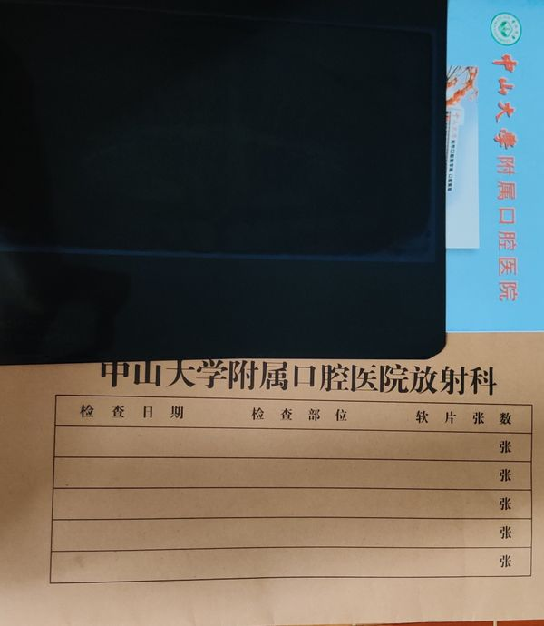
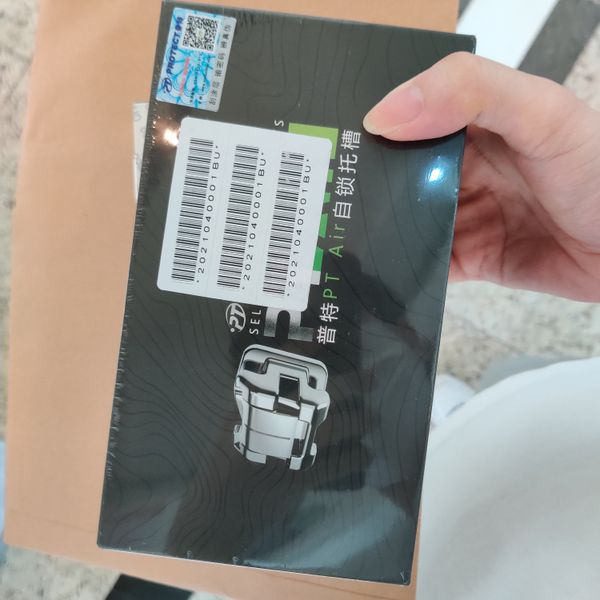
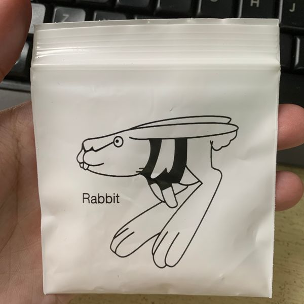

前两年智齿经常发炎，饱受折磨，而且下门牙也歪得离谱，所以决定去把智齿拔了做矫正。在广州这种一线城市做矫正的都好贵，特别是公立医院，我当时图省事就直接去了光华医院。一年多下来算了下花费真的多，下面列了下清单。

| 地点 | 时间 | 花费 | 备注 | 资料 |
| --- | --- | --- | --- | --- |
|光华医院-挂号|2021/04/12|10|公众号挂号||
|光华医院-病历本|2021/04/14|1||
|光华医院-X光费|2021/04/14|202.4|
|光华医院-CT|2021/04/14|376|||
|光华医院-卫生材料费|2021/04/14|43.5|拍片后自己在医院打印
|门诊-麻药|2021/04/14|150|50元/支 * 3。光华拔牙难预约，所以在外面诊所拔牙，医生推荐的
|门诊-拔牙上下四颗|2021/04/14|2900|上两个1200+下800+下900（这个比较难拔+100）|
|门诊-缝线|2021/04/14|200|100元/次 * 2。麻药拔牙缝线共3250刷社保卡
|国康医药|2021/04/14|7.7|地赛米松片 和 头孢呋辛酯片。消炎消肿用
|门诊-拆线和洗牙|2021/04/24|350|
|门诊-补牙|2021/04/24|1400|补三颗蛀牙。单面洞树脂充填400 * 1 + 双面洞树脂充填500 * 2
|光华医院-诊察费|2021/05/21|10|迟到了被医生吐槽了
|光华医院-治疗费|2021/05/21|2948.3|2948.32，实收2948.30
|光华医院-正畸费|2021/05/21|14045.3|
|光华医院-正畸材料费|2021/05/21|4223|金属自锁牙套||
|光华医院-复诊|2021/07/30|389.2|挂号诊察费10，检查费28.26，治疗费255.2，正畸费95.78。总389.24收389.2
|光华医院-复诊|2021/10/08|389.2|挂号诊察费10，检查费28.26，治疗费255.2，正畸费95.78。总389.24收389.2
|光华医院-复诊|2021/12/09|389.2|
|光华医院-复诊|2022/02/09|408.9|
|光华医院-复诊|2022/04/08|389.24|
|光华医院-复诊|2022/05/31|389.24|戴橡皮筋了，医生说快可以拆了||
|光华医院-复诊|2022/07/19|389.24|换成线绑住
|光华医院-复诊|2022/08/30|2177.39|拍CT&拆掉牙套，戴保持器|
|光华医院-复诊|2022/09/15|10|拿哈雷保持器，之后可以不用透明的，直接戴哈雷保持器就行

现在总共花费已经31798.81元，之后还需要再去复诊拿另一个保持器，应该就可以结束了。

现在总结下来想想，我应该多跑几个医院对比下价格的，也许能便宜些，还有不该去小门诊拔牙补牙的，这些在公立医院是可以报销的，这些需要了解清楚。

最后建议要去做矫正的小伙伴，矫正前多吃几顿好的，大吃大喝都不为过，戴上牙套之后接下来几年都没法痛快吃饭的，矫正这段期间我的体重掉了差不多十公斤！

修改：2021-09-15