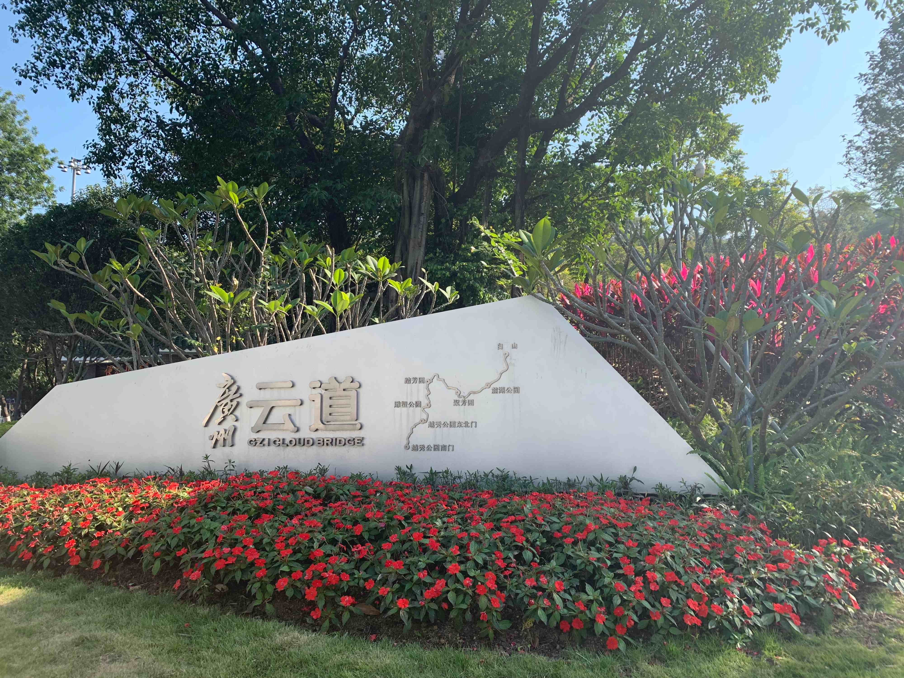
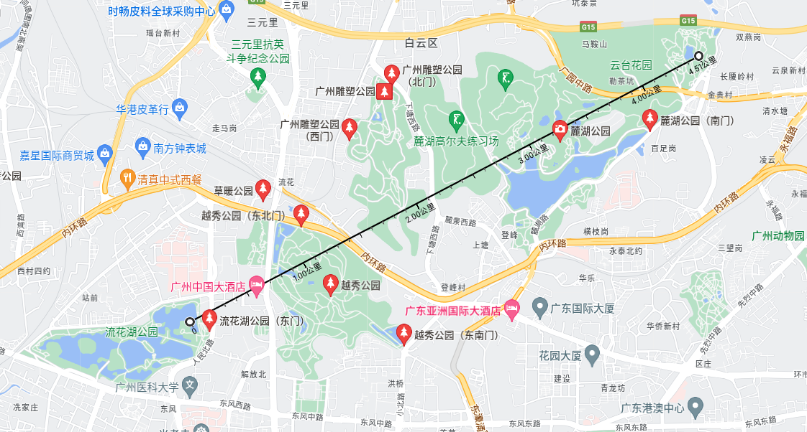
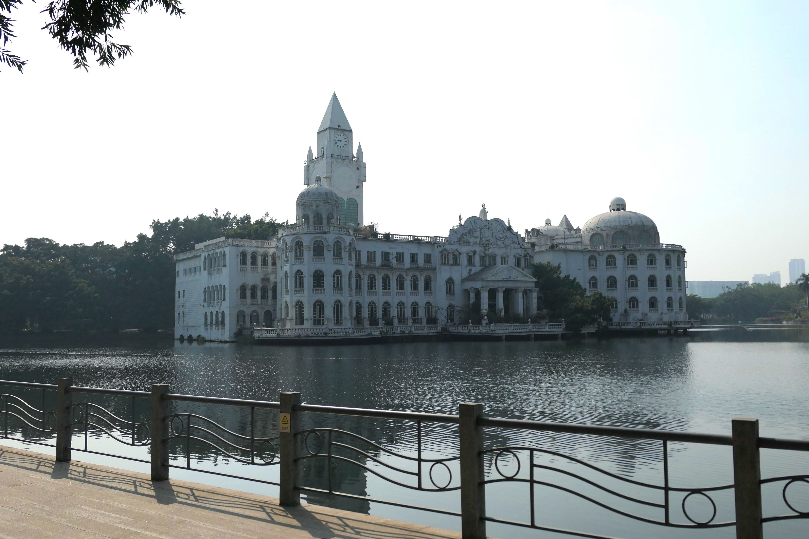
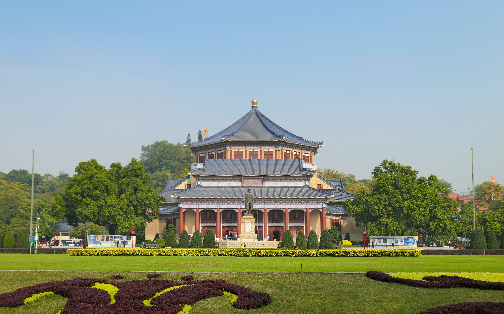
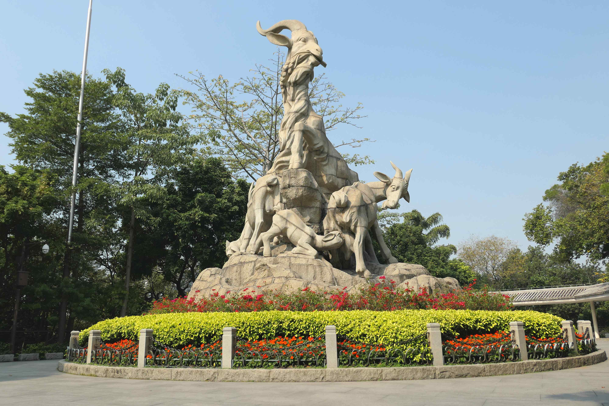
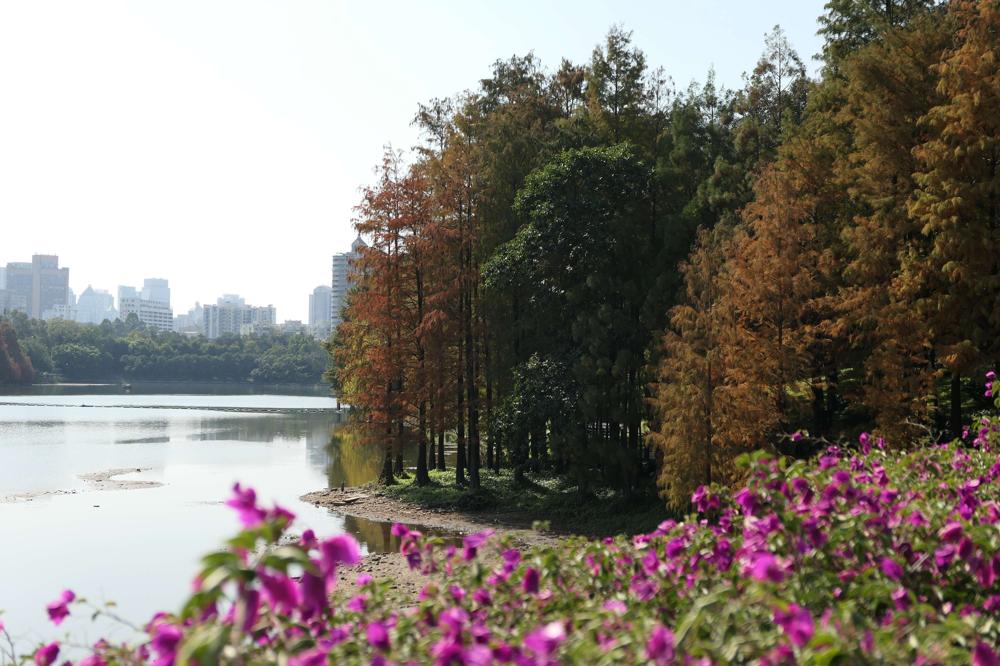
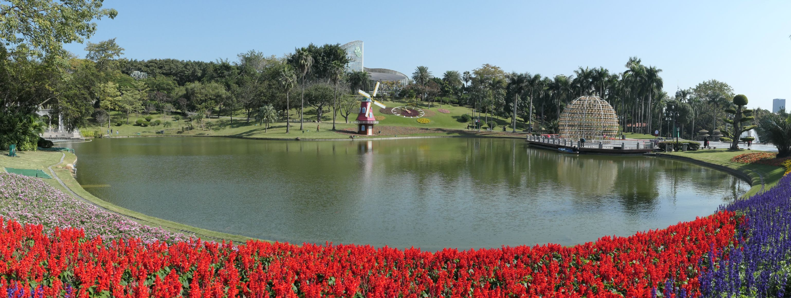

说起广州的旅游资源，大多人都不以为然，觉得广州没啥好玩的，更多的是讨论来广州吃什么东西。其实除了一些知名的旅游景点之外，广州有很多公园，也是平常出去活动活动的好去处，适合常住在广州偶尔周末或放假去转转，不过作为旅行路线的就不推荐了。

广州有条徒步路线——广州云道，从中山纪念堂到白云山山脚，连接了很多个公园。

这一片地区刚好分布了许多公园，甚至可以把流花湖公园一起连接起来，徒步的时候走个够。

不过我自己去过的公园也不算多，以后有时间再去其他公园转转。下面写一些去过的公园的印象。

#### 天河公园 

天河公园是去过最多次的公园了，以前在信息港上班的时候就经常午饭过去逛逛。而且我住在附近，夏天有时回去跑步。

#### 流花湖公园

流花湖在越秀公园西南方向，里面有个流花东苑艺博物馆，展出的东西全是各种各样的石头，挺好玩的；还有个法兰克福玫瑰园，当时冬天去的不是时候，春夏应该比较好看；另外还有一座白宫风格的酒楼，不过不开放好像也没维护的，看起来比较破败了。

公园里有很多猫。

.JPG)

#### 越秀公园

越秀公园很大，里面的景点也很多，比如中山纪念堂、五羊雕像、镇海楼（广州博物馆）。

中山纪念堂其实没什么好看的，门票还要10元，里面就是个剧院而已。

熟悉的五羊雕像。

镇海楼也要10元门票，上次去没进去。

#### 岳麓公园

岳麓公园冬天去拍松林挺好的，可惜我拍了好多都不好看......

#### 云台花园

门票10元，园中又遍植中外四季名贵花卉。花园旁边还有个白云山索道，可以直接上白云山，上山单程票25元。

