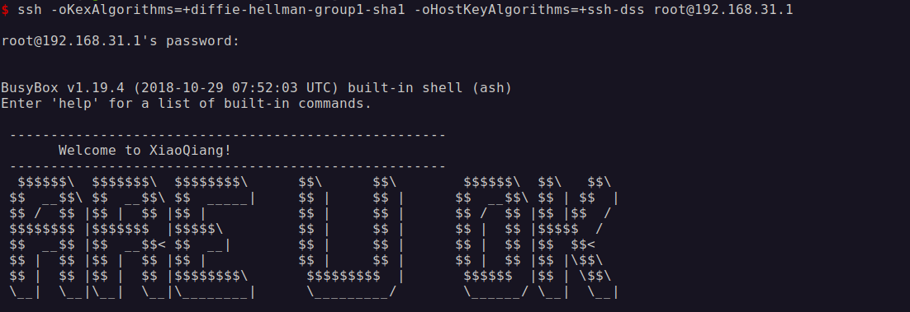
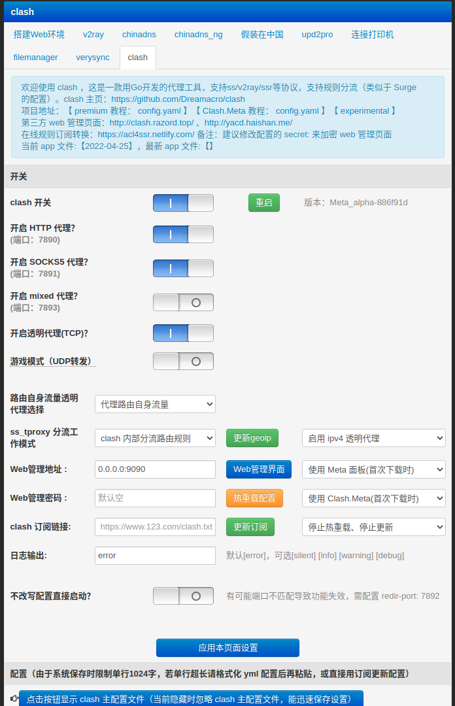
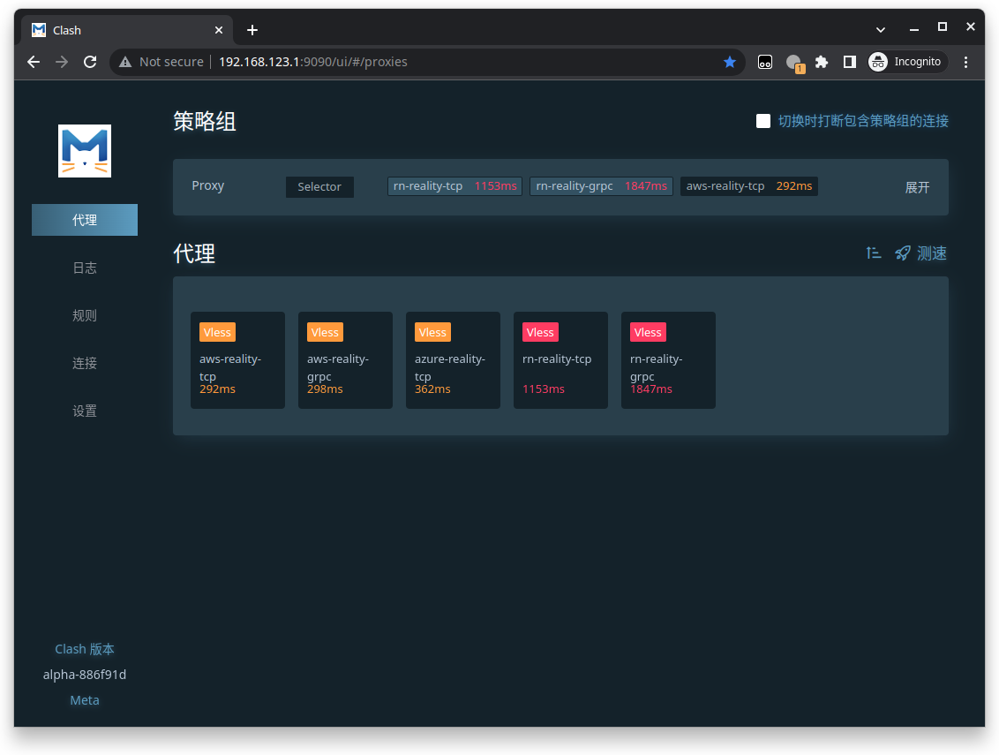

之前用的路由器性能太差了，带宽也太小了，连开个串流都费劲，所以想买个新的。现在的千兆 WiFi6 路由器也都普及了，只是我是一个人住房间小实在用不上那么好的路由器，所以在多多花50几块钱淘了个小米R3G，配置双千兆 + 128M闪存 + 256M内存 + USB3.0，刷机也比较简单，也能用上科学上网插件，足够用了。

<!-- more -->

要用到的资源的地址：
- 小米路由器官网：http://www1.miwifi.com/ 
- Bootloader 固件 Breed：https://breed.hackpascal.net/ 
- Padavan 固件：https://opt.cn2qq.com/padavan/


### 刷开发版固件

解锁 SSH 需要先刷开发版固件，先到小米路由器官网 - 下载 - ROM，找到对应的开发版固件下载下来（[miwifi_r3g_firmware_12f97_2.25.124.bin](https://bigota.miwifi.com/xiaoqiang/rom/r3g/miwifi_r3g_firmware_12f97_2.25.124.bin)）。

然后按照以下步骤刷入开发版固件：
- 开发版ROM 包复制到 FAT 或 FAT32 格式U盘的根目录，并重命名为 miwifi.bin ，同时确保该目录下不存在其它“.bin”文件，若存在会导致刷机失败；
- 断开小米路由器的电源，将U盘插入路由器USB接口；
- 按住 reset 键，接通电源，等待指示灯变为黄色闪烁状态后松开 reset 键（大概十来秒），路由器开始刷机；
- 完成后系统会自动重启。路由器指示灯变蓝刷机完成；如果出现异常、失败、U盘无法读取的状况，会进入红灯状态，建议重试或更换U盘再试。

### 解锁SSH

小米路由器官网 - 开放 - 开启 SSH 工具，下载解锁 SSH 工具包，记下 root 密码。这里需要绑定小米账号才能下载，PC 浏览器下载无反应的话用手机去下载。

确保工具包文件名为 miwifi_ssh.bin，操作过程同刷开发版，确保U盘只有 miwifi_ssh.bin 文件，断电插入U盘，按 reset 通电黄灯闪烁松开等待解锁完成。

解锁完成就能进入路由器内部系统了，由于固件比较老，如果碰到错误 `Unable to negotiate with 192.168.31.1 port 22: no matching key exchange method found. Their offer: diffie-hellman-group1-sha1,diffie-hellman-group14-sha1`，如果指定 diffie-hellman-group1-sha1 还有错误 `Unable to negotiate with 192.168.31.1 port 22: no matching host key type found. Their offer: ssh-rsa,ssh-dss`，SSH登录指定下加密算法登录：

```bash
ssh -oKexAlgorithms=+diffie-hellman-group1-sha1 -oHostKeyAlgorithms=+ssh-dss root@192.168.31.1
```



### 刷入Breed

https://breed.hackpascal.net/ 下载对应版本固件（[breed-mt7621-xiaomi-r3g.bin](https://breed.hackpascal.net/breed-mt7621-xiaomi-r3g.bin)），上传到路由器：

```bash
scp -oKexAlgorithms=+diffie-hellman-group1-sha1 -oHostKeyAlgorithms=+ssh-dss ~/Download/breed-mt7621-xiaomi-r3g.bin root@192.168.31.1:/tmp
```

执行命令：

```bash
mtd -r write /tmp/breed-mt7621-xiaomi-r3g.bin Bootloader
```

成功后自动重启。

https://opt.cn2qq.com/padavan/ 搜索MI-R3G下载对应固件。

随后将路由器断电，按住小米路由器reset键不放，上电等待小米指示灯开始闪烁，再松开 reset 键，即进入 breed 控制台模式。网线连接访问 http://192.168.1.1 即可打开breed控制台。

### 刷入Padavan

在breed控制台直接上传 Padavan 固件就行了，刷入成功后访问路由器后台http://192.168.123.1，默认密码是 admin/admin。

高级设置-外部网络（WAN）设置宽带上网。

高级设置-系统管理-服务，启用SSH服务。

扩展功能-搭建 Web环境设置 clash，如果用上 Vision 和 Reality 协议需要选择 meta 内核，然后有订阅的填上订阅地址，自己写配置文件的，点击“点击按钮显示主配置文件”的选项，把自己配置粘贴进去，点击应用本页面配置等待启动。


等待启动成功点击 Web 管理界面就能看到面板了。

