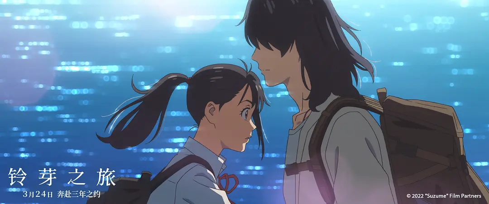

> 我想要活下去，想听见你的声音。

新海诚电影风格一直以来都是以精美的制作画面和青春男女的 相遇相知  相爱或相忘的故事吸引人的，从十几年前的[《秒速五厘米》](https://movie.douban.com/subject/2043546/)和[《言叶之庭》](https://movie.douban.com/subject/20470074/)到近些年[《你的名字。》](https://movie.douban.com/subject/26683290/)和[《天气之子》](https://movie.douban.com/subject/30402296/)，不仅能看到制作水平的进步，剧本的风格转变。尤其以《你的名字。》的成功，让新海诚这块招牌打得愈加响亮。不过，这次的《铃芽之旅》打破了人们以往对新海诚电影的固有印象，电影要表达的有更多的东西，但是也有很多批评，我个人总体来说《铃芽之旅》相比较《你的名字。》的表现差。

电影四月份上映的时候就去影院看了，一开始先入为主，以为是新海诚传统的电影风格，又一个男女爱情故事，可是越往后面看越觉得感情线好像不是那么重要。

故事开始是女主铃芽无意中拔出要石，引发灾厄，要石变成白猫（大臣），诅咒草太肉体消失附身在三腿小座椅上。随后草太为了抓住大臣变回人形，一路跟随大臣的逃跑路线开启了一边抓猫一边关闭沿途被打开的后门的旅程。总体看下来这部电影既像爱情片又像公路片，也可以是纪念地震的。事实上，我认为纪念地震才是电影的主题，这就导致我在影院看的时候觉得观感很差，各条主题线混杂在一起，但是新海诚明显没处理好。而且电影里细节很多但又不明显，需要对日本的地震史（[东日本大震灾](https://zh.wikipedia.org/zh-cn/%E6%9D%B1%E6%97%A5%E6%9C%AC%E5%A4%A7%E9%9C%87%E7%81%BD)）有了解一些，白猫黑猫又代表什么，动机是什么，只看一遍很难理解，现在电影在流媒体上线了重新看了一遍，才看到了更多的细节。

首先说感情线，很多人都觉得男女主的情感发展很奇怪。电影开头铃芽觉得见过草太这里呼应了结尾在长世小铃芽遇见了男女主，后续草太变成椅子就奇怪起来了，从一只椅子去了解一个人太抽象了，而且一路上两人在做的都是关门师的任务，更像干活的同事。

不过对铃芽人物的刻画就好多了，叛逆、活泼又勇敢的女高中生。不过也许有的人更喜欢神明化身的猫，大臣的形象真的讨喜。铃芽把要石拔出来，大臣作为要石镇压灾厄的使命也完成了，并且使命转移到了关门师草太身上。大臣喜欢铃芽，而铃芽因为自己错误拔出要石而导致草太要作为要石牺牲，决心要救草太，这样就形成影片的故事冲突点。最终大臣被铃芽感动愿意重新化为要石镇压灾厄，也许是明白铃芽并不是真正意义上的喜欢自己，也许是明白身为神明的职责，这种二选一的剧情，看得还是让人难受的。

说回我认为的真正主题，影片的立意为了纪念地震，众所周知，日本是一个地震灾害多发的国家，自古以来饱受地震的影响。人们时时祈求神明的保佑，影片中提到“思念的重量，能够镇压住这片土地，有些地方已经被人们遗忘了，促使后门被打开。”神明人们的信仰而存在，当被人遗忘了就没法镇压土地，所以要思而复思，时刻感谢日不见之神的恩赐。同时，也要求人们要勇敢面对灾难，永远不放弃对生的渴望。铃芽最后把凳子给小时候的自己作为与过去告别，放下过去的伤痛，回到生活中，去体验爱情（与草太），珍惜活着的亲人朋友（姑姑岩户环），互相帮助有需要的人们（民宿店的千果，酒馆的老板瑠美）。

随手的写的感想，看起来很乱，思路也是乱的，网络上已经有很多人写了很多思路清晰的影评，比如可以看看这两篇影评：
- [新海诚突破自我的大进阶！解析《铃芽之旅》的社会议题与关键细节](https://movie.douban.com/review/15046115/)
- [《铃芽之旅》：灾难和废墟叙事后的治愈](https://k.sina.com.cn/article_6324864954_178fdc7ba01901gm9a.html)
