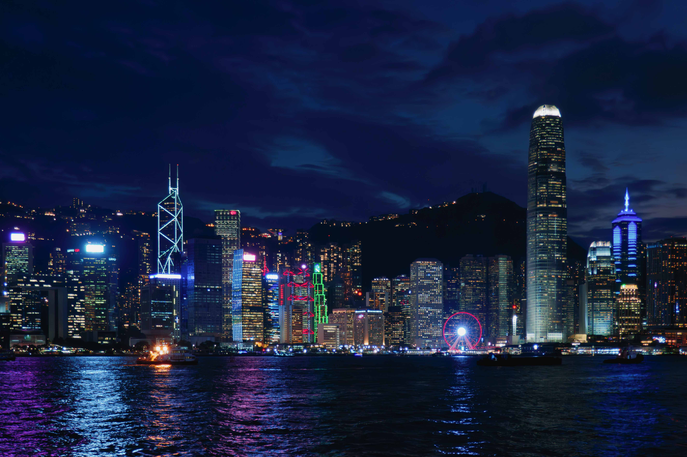

国庆前本来就打算去一趟香港的，结果错过了中旅的巴士没去成。长假过后（10月11日）重新买票过去，这才发现中旅的车是类似公交车的运营方式，买好票后自己按时上车，没有人通知，也不需要确认车牌号的，就突出一个出行简单，不打扰人。

<!-- more -->

10月9日的时候有个台风“小犬”过境香港，这名字可爱，只是下的雨可不小，11日天气开始转好，台风天过后天气凉快，也有阳光，适合出行，所以就这天过来了。

路线：尖沙咀 - 中环海滨摩天轮 - 太平山卢吉道 - 湾仔 - 文化中心/艺术馆 - 星光大道

<iframe src="https://www.google.com/maps/d/u/0/embed?mid=1-CzImcNpEndykatlAr1VhIkKCZCs1eQ&ehbc=2E312F" width="640" height="480"></iframe>

7:20从东圃上车，9:00就到深圳湾口岸处境香港了，再换乘香港的巴士直接到尖沙咀中港城刚好11:00。然后就在中行的 ATM 取钱，结果死后取不了，也不知道为啥，干脆就没取了，反正已经在 iPhone 上开好了八达通，也够在香港畅通无阻了。

作为一个对探索美食没那么大兴趣的人，午餐还是选择熟悉的麦门，我知道有些人旅行其实就是为了到处吃吃吃，确实品尝美食也是旅途的一部分意义。尖沙咀天星码头附近就有一个麦当劳，而且码头入口这里刚好还有一个领取[“香港有礼”](https://www.discoverhongkong.cn/china/deals/hkgoodies.html)的地方，香港有礼其实就是旅客消费优惠券。

做天星小轮过维多利亚港，到达港岛中环，摩天轮打下卡。中环地铁站附近，穿过皇后大道（还记得那首[皇后大道东](https://www.youtube.com/watch?v=m9v6VIj500I)吗），到达山顶缆车，刷八达通上太平山，上山62HKD下山26HKD。到达山顶广场走卢吉道，到达卢吉道观光点，可以看到维港全貌，可惜上山天气转阴天了，拍照没那么好看了。

下山到银行街，顾名思义就是有很多银行，本来想去办银行卡的，但是想到现在没工作想办应该很难，就放弃了。银行街做叮叮车到湾仔码头，坐船回尖沙咀。继续打卡香港文化中心和香港艺术馆，先去看的艺术馆，可惜时间还是不够了，艺术馆共五楼看到三楼就快六点了要闭馆了，没看完。艺术馆内容其实还是岭南传统和贸易城市的一类东西，跟广州十三行博物馆有些相似，展馆本身也是由广港澳三地的博物馆单位联合设计的。

天黑后就到维港看夜景吹海风去了，有趣的是一天中碰到好几个外国人要我帮他拍照，甚至还有是一个family十来个人的合照，，可能是因为我手上拿着相机，一个走在路上显得悠闲有时间才会被拜托帮忙拍照吧。只是我一直拍的是风光不拍人，真不会拍人，帮他们拍都是随手按下快门就完事了，英文不咋滴也没法跟他们沟通太多，我知道“good、awesome”都是礼貌而已的啦哈哈。

有人说香港已经不是以前的香港了，时代环境和政策的变动太多了，但是香港依旧还是大陆最开放最国际化的城市。关于对内地的偏见和语言的问题，由于我不怎么跟人交流，还没碰到这类现象，实在不行，干脆只说英文得了。
