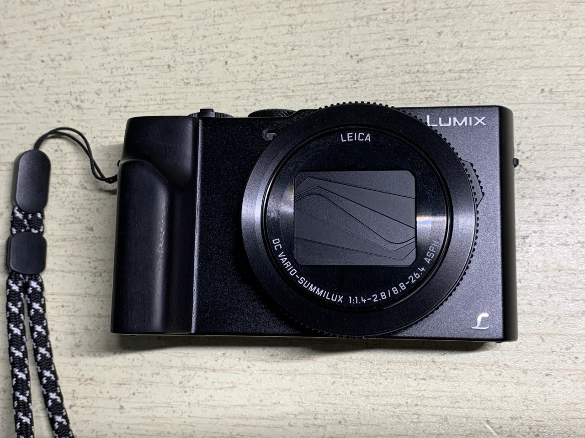
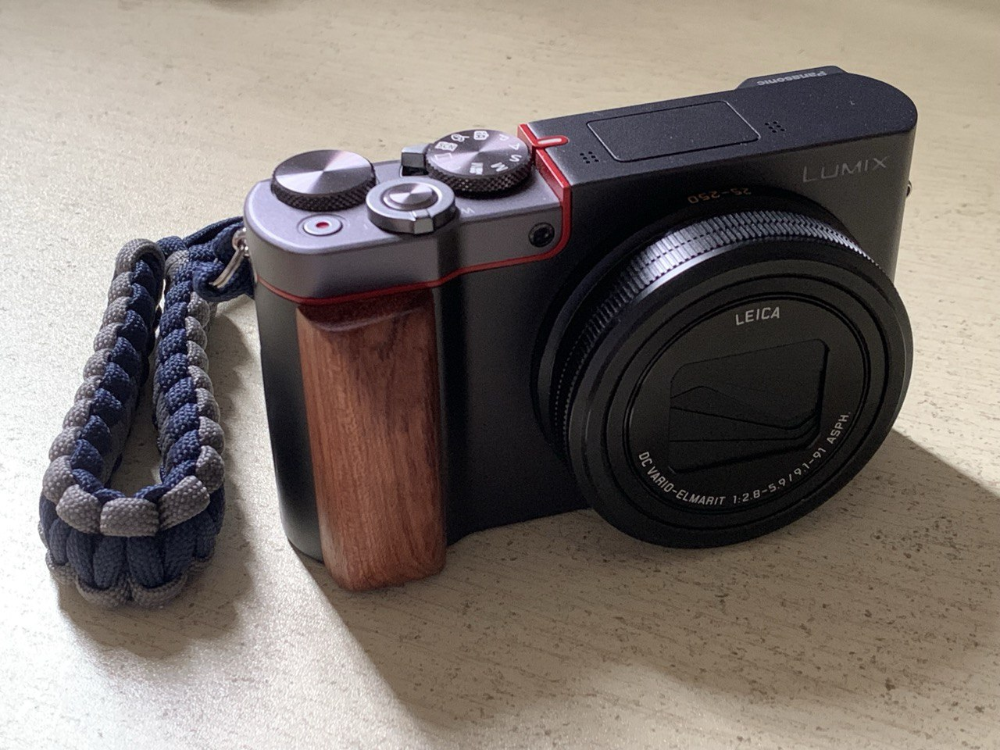

一般想买卡片机的人看中的都是便携性，虽然现在的微单都在尽量往便携方向设计，但加上镜头依旧不算非常轻便。卡片机兼顾便携和比一般手机更好的画质，不过现在旗舰手机的摄影也很强了，卡片机在画质也没明显的优势了，只是在操控和可玩性更强一些。综合来说，既要非常便携，随便能装进口袋随手就能拿出来，又想要相机更多的可玩性，卡片机才值得入手。

用过的两个松下的卡片机 LX10 和 ZS110，他们有相比索尼黑卡更便宜的价格，而且松下的操控系统也好用多了。这两款相机参数不同也各有优缺点。

LX10 F1.4-2.8 24-72mm

ZS110 F2.8-5.9 25-250mm

LX10的焦段太局限了，卡片机拍人其实都不咋滴，LX10 也只是比 ZS110 好一些，而且小巧便携就是为了出门方便拍景，明显焦段范围更大的 ZS110 更实用些。不过 LX10 的做工比较扎实小巧，翻转屏也好使；ZS110 相对 LX10 大一点点，没有翻转屏，多了一个取景器但是太小，基本是摆设，做工一般，前面板按键真的松垮。

