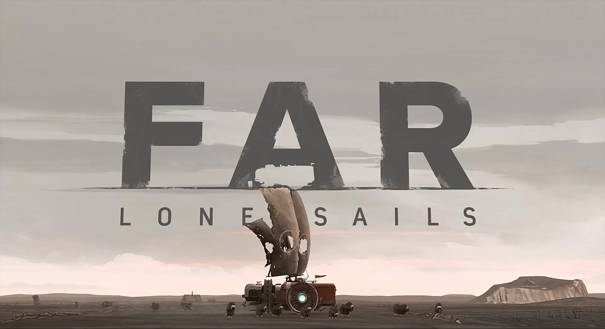
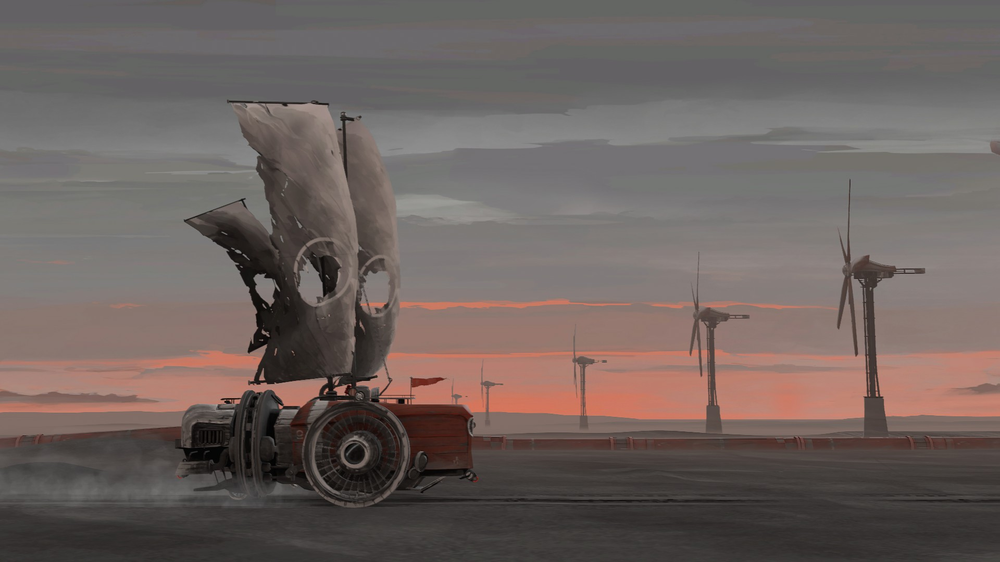
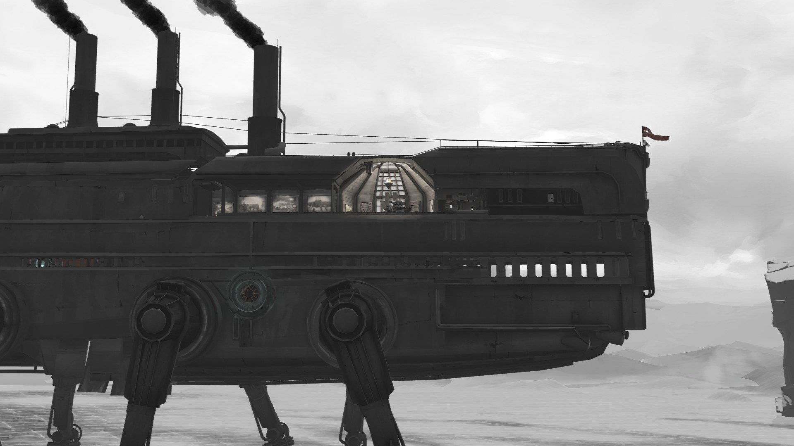
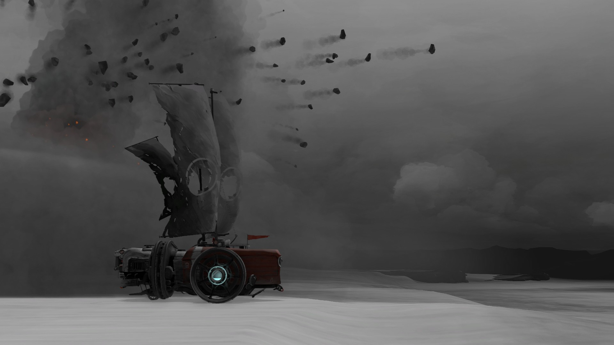
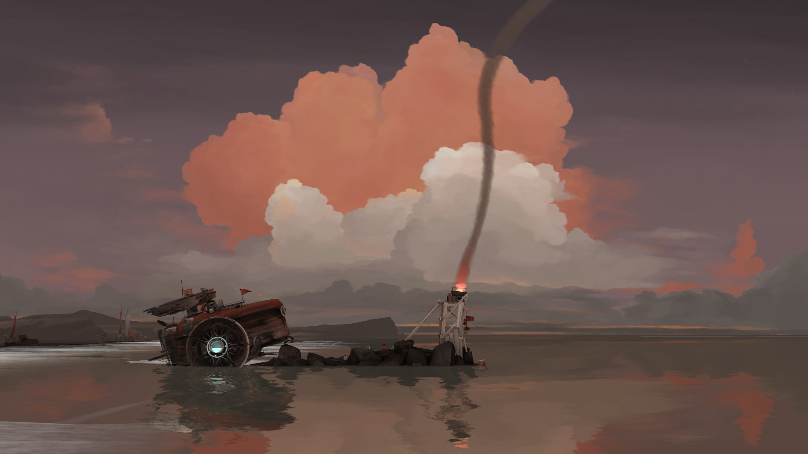

> I remember a different world. I am not alone.

最近在小黑盒看到这个打折的小游戏，这几年越来越喜欢玩这类小游戏，流程较短，制作精良，而且经常有让人眼前一亮的作品出现。另一个原因是3A大作实在是玩不动了，虽然说不是没时间没精力去玩，但是没有那种持续性地、几十个小时沉浸在一个游戏的耐心，没有继续玩下去的渴望，现在有人称这种现象为“电子阳痿”（当然也很多表现，这里说的只是一种）。

<!-- more -->

_FAR: Lone Sails_ 以末日世界为背景，主角小红人独自穿越干涸的海洋，在途中获得一辆车，一路上找油桶给车加油，给车加上风帆、换轮子、加进气口，装备灭火器和修理工具。

跋山涉水，行驶在在漫天星辰的夜空下，在雷雨冰雹中，在银装的雪地中，这是一场孤独的旅行，一路上没碰到其他同类，有点[《少女的终末旅行》](https://movie.douban.com/subject/27081136/)中两位少女漫无目的地持续着旅行。

一路中会碰到各种建筑遗迹，最好玩的是还能进入一架类似星球大战中的[全地形装甲步行机（AT-AT WALKER）](https://www.starwars.com/databank/at-at-walker)的大型机器。

碰上了火山爆发，拼命加速逃跑...

可惜车子还是受损了，动力系统被毁，只能靠风力继续前进。

在终点将剩下的燃料点燃一摊篝火，结束这段旅程。

