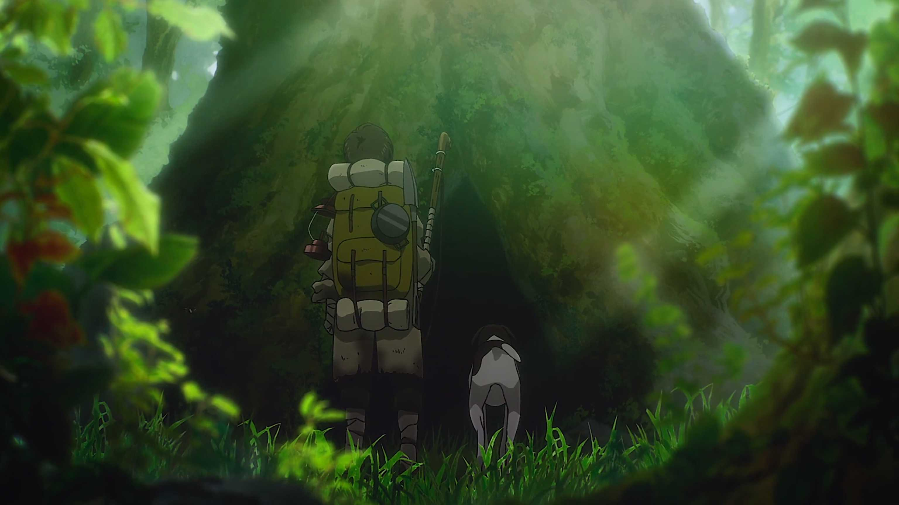

忘记是什么时候开始追[《进击的巨人》](https://movie.douban.com/subject/23748525/)动画的了，只记得当时是看[《钢之炼金术师》](https://movie.douban.com/subject/3430169/)时，经常看到有人将这两部作品相提并论，当然经常是评论区吵得不可开交啦。开始看进巨的时候以为又是一部热血王道番剧，不过当动画剧情的发展和看了部分漫画版后也知道作者的立意不是如此单纯。

<!-- more -->

《进击的巨人》2009漫画开始连载，2013年动画开播，2023年结束，出场人物众多，角色形象鲜明。比如主角团三人组主角艾伦、军师阿尔敏和类似保镖角色的三笠；调查兵团团长埃尔文、一米六的兵长利威尔；九大巨人每个都有不同的特点。十年的跨度很大，很多情节现在我也都记不清了，不过动画贡献的许多梗却一直为人们熟知，有初见巨人的“那一天，人类回想起了被它们所支配的恐惧...”，有战斗时的“塔塔开”和“献出心脏”，还有漫画结局艾伦的“那种事情不要啊”。

剧情的走向就是认识世界的过程。一开始讲述的是人类因为巨人被束缚在围城之中，壁外调查是为了挣脱束缚，追寻自由。当墙内人们突破封锁来到海边的时候，知道海的对岸还有另外的世界，这时候才知道这是国家间的战争。再随后在与马莱国的对抗中逐渐知道巨人的真相，这时候主角的追求也更加深入，想要结束两千多年艾尔迪亚和其他种族的战争。

漫画的结局被很多人诟病，虽然是架空世界的题材，但是也有一些现实社会的映射，有些人会认为是给日本军国主义的洗白，可能在作者的生活中还是很难避免日本社会的影响，但是动画版的结局看完之后还是更像 war never changes 的模板，当在末世的废土中少年和他的小狗走进始祖树中，会不会又是一个文明的轮回呢？

谏山创立了很大的意，但却给了一个现实的结局，不够爽，不够圆满。而且也有一些很难自圆其说的情节，比如说把始祖尤弥尔的动机解释为扭曲的爱情，然后就是没有交代怪诞虫是什么东西，只能理解为一个设定。

在我看来，进巨的核心有三点，一是反战，二是有人类就有纷争，三是不放弃对自由和平的追求。动画十年跨度太大了，很多剧情我都记不太清了，这篇短评写得挺混乱的。

