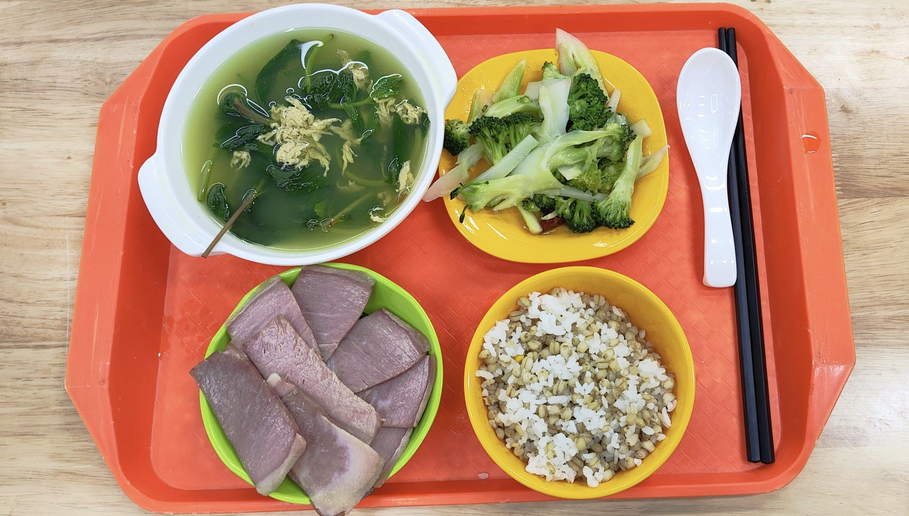
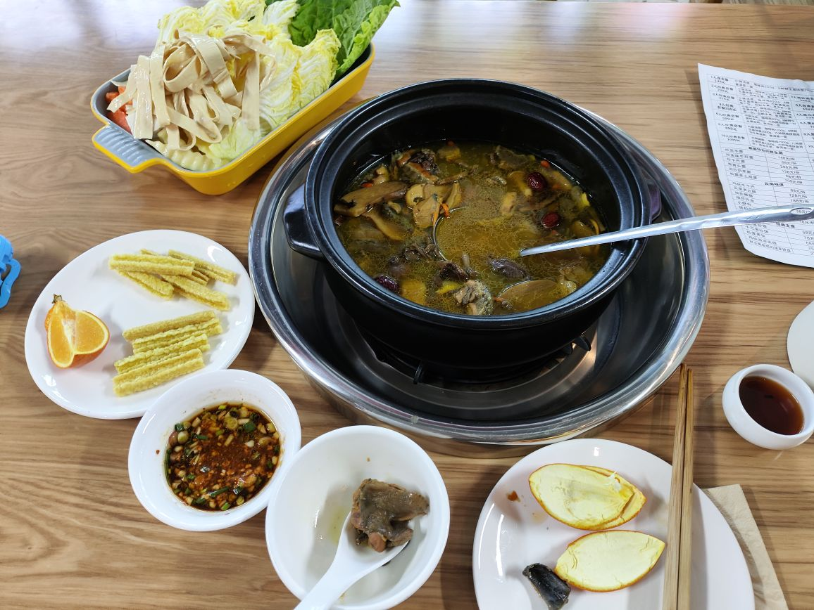

在广东湿冷的天气里实在受不了，看了全国的天气预报，只有西南和海南还是好天气，所以我决定到昆明走一走。

<!-- more -->

其实一开始是非常想去泰国走一走的，因为从来还没有出过国，事实上去昆明也是自己第一次一个人出省回广州也是第一次做飞机。虽然泰国免签了，但是出国还是相对比较麻烦而且不告诉家里感觉非常不好，所以还是决定去昆明，毕竟在国内就没什么顾虑了。

<iframe src="https://www.google.com/maps/d/u/0/embed?mid=1tYvl8OIk7HrR9zEBaoe9J9Uahy_mBv4&ehbc=2E312F" width="640" height="480"></iframe>

### Day 1

一到昆明最大的感触就是，生活节奏是慢悠悠的，司机是会让行人的，电动车的出行体验能这么好（如何你来过电鸡之城广州对比就嫩感受到了）。

因为是临时决定要来的，机票看起来很贵，所以是做的高铁晚上到昆明，晚上先到昆明老街逛逛，就是全国大同小异的商业街，这边普遍关门都会早一点，啥都吃不上，没得选只好随便吃了螺蛳粉。以前是觉得又辣又臭不吃螺蛳粉，实际吃起来还行啦，辣点也不怕，好像只要离开广东吃辣都不会长痘了，上次在贵州也是吃了一堆辣一点事都没有，水土气候影响真神奇...

### Day 2

第二天早上到翠湖，好像在昆明只要是个公园只要有水的地方都有海鸥，翠湖这里还有松鼠，真的可爱。

翠湖附近也是各种学校和历史建筑的聚集地，云南陆军讲武堂、云南大学、云南师范大学和西南联大博物馆等都在这里。中午在云南大学吃的饭，非常实惠，有一碗切片的咸猪肉，下面是青瓜，很好吃。

吃完饭逛了下云南师范大学，然后下午西山风景区，又是爬山哈哈，下次出门不想爬山了。不过西山上风景还是不错的，能俯看到昆明市区和滇池，

做巴士和电瓶车到西山风景区，然后爬山到龙门石窟，因为在山上拍湖边公路，等车辆经过等了好久一直没车，结果下山过了5点错过做滇池索道到海埂大坝了，这景区运营下班真早，我5点多到滇池索道的时候卖票窗口早关了，景区服务员在疯狂干饭，真的，疯狂扒拉😂。

晚上去吃了过桥米线，过桥米线可以不辣的，感觉云南很多食物都可以是不辣的，这对吃不了辣的人群真是太友好了。

### Day 3

第三天早上到云南省博物馆，云南省博的外观设计跟广东省博差不多，都是方方正正那种，展馆有三楼，按时间线从生命起源讲到云南现代，就...非常直接，此外在一楼还有个香格里拉主题展馆。展品算不上丰富但是看起来还是比广东省博强些。

下午本来想去捞鱼河湿地公园的，但是比较远感觉实在是累，所以去了海埂大坝，沿着滇池岸边从海埂大坝骑共享电动车到海洪湿地公园，不过这边就没法看到好看的日落的...

晚上去吃了菌子火锅，小红书推荐的，感觉踩雷了，菌子想和鸡肉都不够新鲜，一个人一百来块不便宜了啊，到目前为止还没有吃过比家里这边潮汕牛肉火锅更好吃的火锅。

### Day 4

第四天早上到篆新农贸市场，买了草莓和蓝莓，听说这市场挺坑外地人的，但是还是买了，就算被坑了还是比广州便宜的。草莓带回广州样子就没法看了不新鲜了，保存运输真是麻烦，怪不得这么贵。蓝莓就好多了基本没问题，放冰箱这几天天天吃很好吃，强烈推荐回家的时候买蓝莓，真的太划算了，草莓就在当地吃完吧别带回家了。

下午到长水机场坐飞机回广州，这是这辈子第一次坐飞机，虽然老家就在机场附近，在广州去白云机场也没多远，但是真没坐过。其实过年我完全可以做飞机回家的，只是觉得不够远没必要，去省外其他地方也去得少，碰到要到省外出差就跟领导拒绝了哈哈，没想到这么多年一直没机会做次飞机。这次做飞机还专门做靠窗位置，可惜到广州下雨了，不管是广州塔还是大蟑螂啥都看不到。

### End

昆明被称为春城，一年之中大部分时候天气都非常好，只是天气干燥得厉害，太阳晒得厉害，滇池的风也大得厉害，如果来旅行的话口罩防晒霜保湿都需要。

昆明节奏比较慢，司机居然是会让人的，非机动车道很宽，共享电动车骑行体验非常棒，走在在人行道上也不用担心被电鸡创。

再见昆明，等下次来云南再到大理转转，到时候也许不怕冷了再到香格里拉看雪山。
