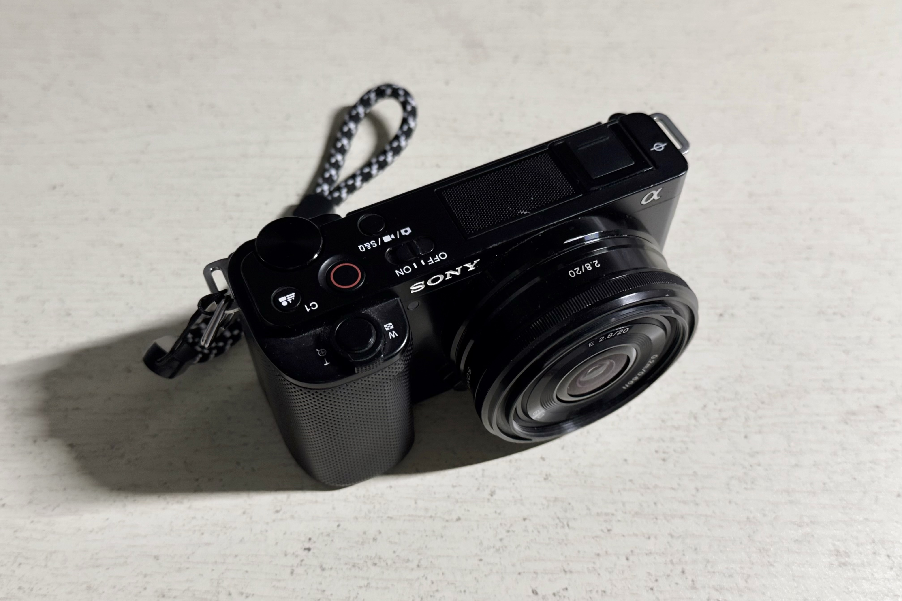
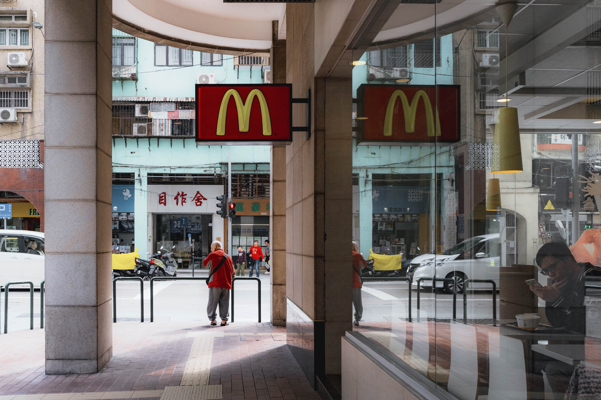
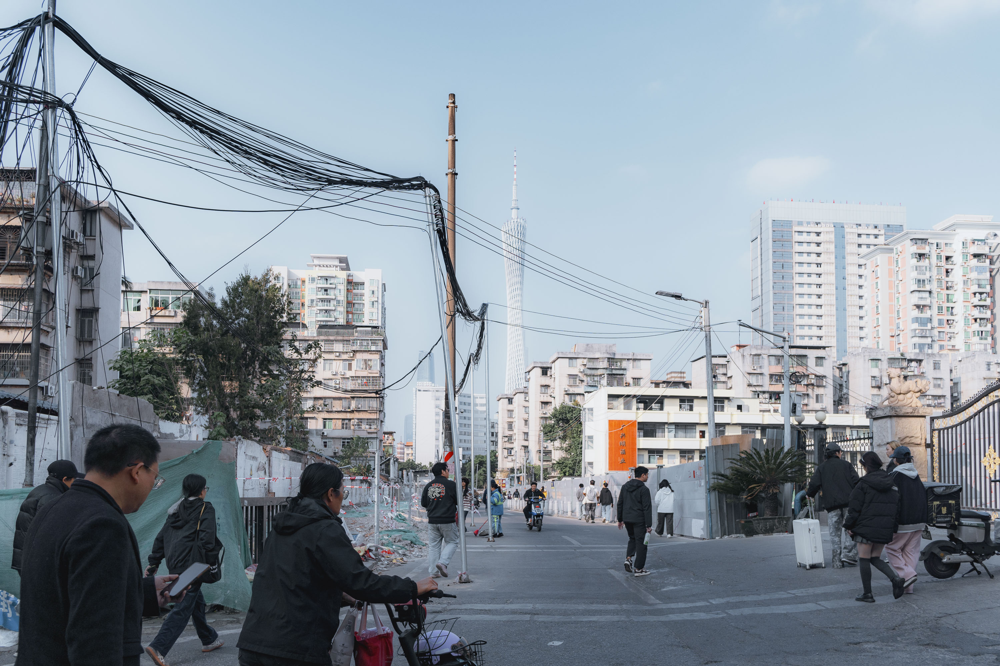
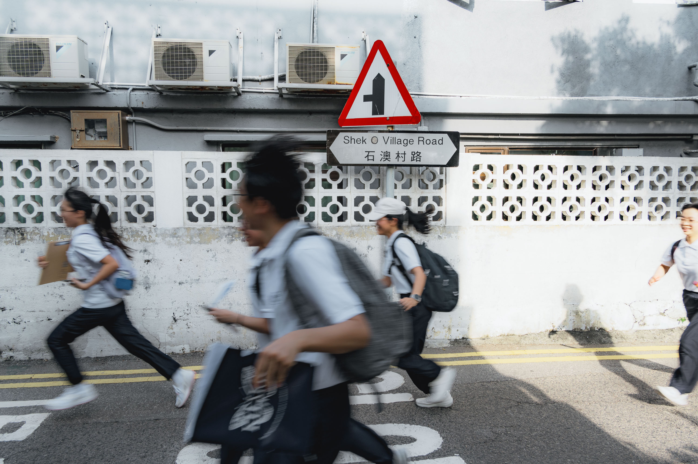

---
title: 摄影
categories: 生活
tags:
  - 摄影
toc: true
date: 2026-01-15
--- 

在过去的两年之中，我差不多按了五万多快门，拍了很多题材，除了妹子......

最近入了一个原厂索尼20mmF2.8镜头，等效30mm的焦段跟经典的28差不多，体积足够小，跟机身一样也是塑料做工，所以这个搭配很轻便，用起来真是顺手，之前的挂机头腾龙18-300mm吃灰好久了。

在拍了多种题材和大量的照片后，也开始有自己的一些想法。

一开始是看很多其他摄影的作品，跟着他们拍的机位自己拍照片，拍照必须出门，所以最近两年出门的次数多了非常多，资金有限就只在珠三角这几个城市来来回回走动。要说最喜欢的城市就是澳门，因为离得比较进，每次去澳门巴士往返只要五十元，还是就是殖民时期留下的老建筑和中西结合的东西很多，跟内地的其他城市差异大，靠海，更重要的是没有电鸡，路上抽烟的人也少，街道干净，所以走街串巷拍照的体验非常好。当然香港也有同样的优点，另外香港比澳门大得多了，可以玩和拍照的地方也不是同一级别的，但是去香港的路费略贵往返的时间太长，每次去香港回来都挺累的。

再后来拍多了，除了社交媒体分享的机位开始多拍自己喜欢的内容，开始觉得呢，拍照应该是反映自己对所见的事物的观察和认知，也就是人们说的审美，审美有高低但也包含主观的看法，不过在大方向上大多人对好看的照片看法基本是一致。

最近也在小红书发了很多拍照笔记，不过看起来是拍得太一般，没什么流量，不想发带节奏的笔记的话就需要自己拍的照片足够好了。

