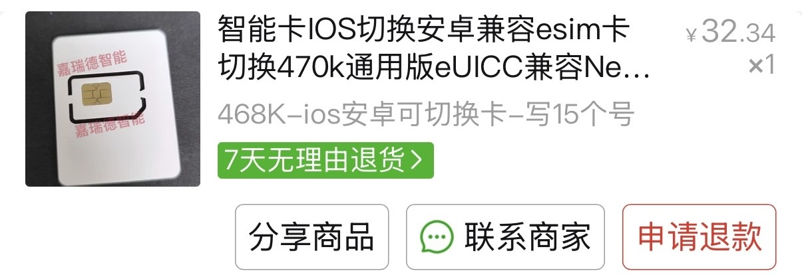
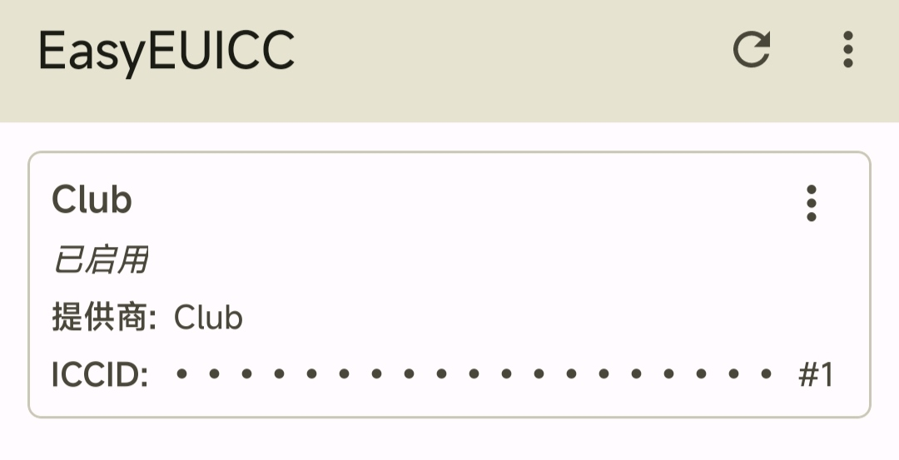

---
title: Club Sim eSim
categories: 生活
tags:
  - 电话卡
toc: true
date: 2026-01-22
--- 

因为需要注册一些服务需要香港的电话卡，搜索一番后觉得这个Club Sim不错，还可以开 eSim，而且无须去香港办理，在内地也能开。

想开eSim首先需要一台支持eSim的手机，如果手机不支持也可以买eSim写入的实体卡，我买了一张470K空间的写入卡。

这类eUICC实体卡可以使用兼容的Easyeuicc APP软件在安卓手机（即使安卓手机本身不能开通eSim功能，苹果非eSim型号都不行）上写入eSim到sim卡中。

买Club Sim eSim直接到[Club Sim](https://www.clubsim.com.hk/zh/quick-start/sim?sim=eSIM)网站买就行，消费必须满50港纸才能购买，所以这里可以买一个中国内地及澳门漫游数据2GB$48和短讯组合$6，总共$54。之后每年买这个6港纸的短讯组合就能继续保号一年。

购买后会发邮件到到邮箱，将写入卡插到安卓手机中，用Easyeuicc APP扫面邮件中的eSim二维码就可以进行写入，写入完毕启用eSim。

之后Club Sim会发短信提醒需要做实名认知，用护照认证就可以，如果不实名认证会被封号的，还是挺严格的。

