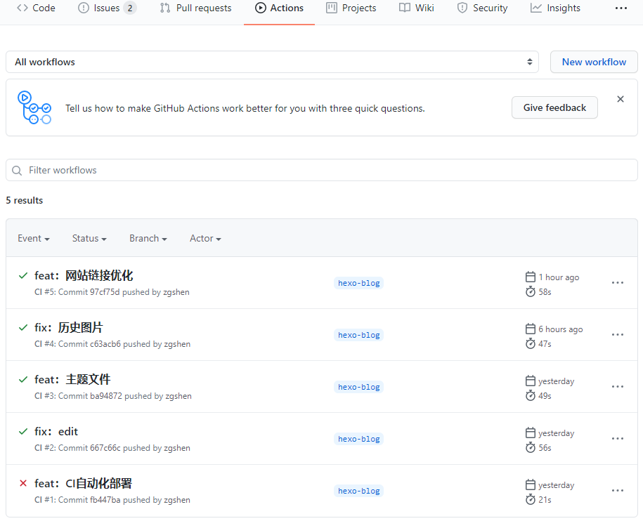

## 新建分支或 git 库存放 Hexo 源文件

折腾一下把 Hexo 网站用 GitHub Actions 进行自动化部署，基本流程是这样的


- master：主干是原来的静态网站资源，也就是 hexo 编译后 public 下的文件；
- hexo-blog：新建一个分支，放 hexo 的源文件，包括配置、主题和 markdown 文本等。

流程就是我们写 markdown 文章后，就推送到 hexo-blog 分支，触发 GitHub Actions 进行自动化部署编译，并把编译完的资源推送到 master 分支，这就完成一次 Hexo 博客的更新。

这里用的是新建 hexo-blog 分支放 Hexo 源文件，新建一个 git 库也是可以，当然 GitHub Actions 也是在新建的 git 库上。

## 配置公私密钥

因为涉及代码的 ssh 推送等交互，所以需要设置私钥和公钥。这里因为是用一个 git 库两个分支来做的，所以公私钥都在当前 git 库设置，如果用的是新建 git 库存放 Hexo 源文件，那私钥要放在 Hexo 源文件 git 库，公钥放在静态网站库上。

生成密钥

```bash
ssh-keygen -t rsa -b 4096 -C "xx@xx.com" -f github-deploy-key -N ""
```

生成两个文件：

- `github-deploy-key.pub` 公钥
- `github-deploy-key` 私钥

打开 https://github.com/xxx/xxx.github.io/settings/keys 填写公钥，xxx github 用户名

- `Title` 输入 `HEXO_DEPLOY_PUB` （自定义名称，后面自动化部署脚本用到，一致就行）
- `Key` 输入生成的 `github-deploy-key.pub` 的内容
- 勾选 `Allow write access` 用于推送分支

打开 https://github.com/xxx/xxx.github.io/settings/secrets/actions 填写私钥（新建git库方式私钥在新建git库上设置）

- `Name` 输入 `HEXO_DEPLOY_PRI`
- `Value` 输入生成的 `github-deploy-key` 的内容

## 自动化部署脚本

在 hexo-blog 分支根目录下创建 .github 文件夹再进去创建 workflows 文件夹再创建 HexoCI.yml 文件

编辑 HexoCI.yml 文件，内容找个别人的抄来用，https://blog.csdn.net/xinruodingshui/article/details/105499161#t4

```yml
name: CI
on:
  push:
    branches:
      - hexo-blog ##分支名
jobs:
  build:
    runs-on: ubuntu-latest

    steps:
      - name: Checkout source
        uses: actions/checkout@v1
        with:
          ref: hexo-blog ##分支名
      - name: Setup node
        uses: actions/setup-node@v1
        with:
          node-version: '12.x'
      - name: Setup hexo
        env:
          ACTION_DEPLOY_KEY: ${{ secrets.HEXO_DEPLOY_PRI }}
        run: |
          mkdir -p ~/.ssh/
          echo "$ACTION_DEPLOY_KEY" > ~/.ssh/id_rsa
          chmod 600 ~/.ssh/id_rsa
          ssh-keyscan github.com >> ~/.ssh/known_hosts
          git config --global user.email "xx@xx.com"
          git config --global user.name "yourname"
          npm install hexo-cli -g
          npm install
      - name: Hexo deploy
        run: |
          hexo clean
          hexo d
```

## 构建结果

Actions 里可以看到每次构建流程，失败的可以进去查看日志定位问题。



## 链接优化

安装 hexo-abbrlink 插件， package.json 中

```json
"hexo-abbrlink": "^2.2.1",
```

配置文件

```yml
url: https://zguishen.com
root: /
permalink: posts/:abbrlink.html
abbrlink:
  alg: crc32  # 算法：crc16(default) and crc32
  rep: hex    # 进制：dec(default) and hex
permalink_defaults:
```

不同组合链接形式不同。
