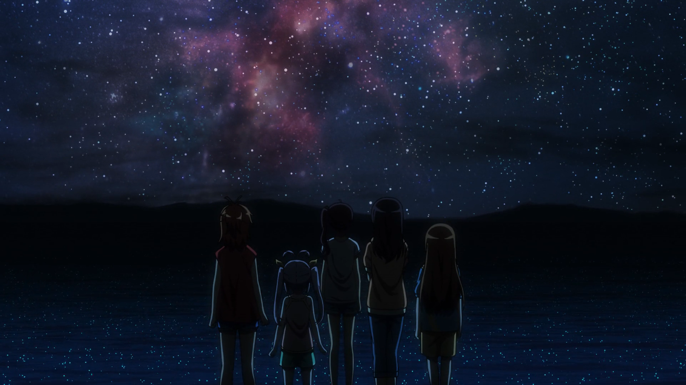

以前对2020年的记忆是课本上的”2020全面建设小康社会“，一晃，2020年已经是历史了。
<!--more-->

在2020年的最后一个月，上班一个多月，试用期期间，我还是选择了离职。说到底就不该入职这个公司，行业并不是自己多喜欢的音视频领域，想尝试坚持试试，但对出差实在反感，还要到长三角那边，这冬天这么冷......

上周寒流来临，广东也正式进入冬天了。天气一冷，皮肤干燥，行动迟缓，精神萎靡，最蛋疼的是鼻子又要遭罪了，一吹风拼命打喷嚏流鼻水。对冬天真实喜欢不起来。

冬日感觉最舒服的事情就是晒太阳了，一边晒太阳一边喝可乐，真的惬意。

上周去电影院看了《心灵奇旅》，明明买单写的是国语版，去到现场结果播的是英语，本来还想听听国语配音怎么样，看网络上评价还挺不错的。  
[心灵奇旅 Soul (2020)](https://movie.douban.com/subject/24733428/)
 

《心灵奇旅》可以说是给了打工人一碗鸡汤。当你进入憧憬的企业上班，日子久了，突然发现每天重复性的上班劳动，这是我们想要的生活么。”What I want is the ocean.“，鱼要找到大海，殊不知已置身于大海之中。生活虽有波澜起伏，更多时候是风平浪静，没必要一直赶着前进，活在当下更重要。

平静的日子回忆起小时候的时光，还是小时候好玩，不过现在看这番感觉有些幼齿了。  
[悠哉日常大王剧场版：假期活动 劇場版 のんのんびより ばけーしょん (2018)](https://movie.douban.com/subject/27063403/)

这个星空场景真的美，现在家里乡下也难以见到漫天星星的夜空了。