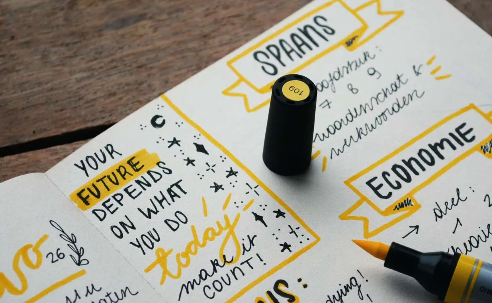

> 被打亂思緒要再重組的確很難，到現在我也仍未掌握「不被打斷」或是「即使被打斷還能輕鬆地整理好思緒、繼續做事」的能力。 注意力被分散的原因可能來自外部或內部，《極度專注力》這本書中則討論到如何開啟「極度專注力模式」。 作者克里斯・貝利（Chris Bailey）提到，想進入這個模式，有 4 個步驟。
不知道是為什麼，有時候在書寫時能夠專心致志完全不受外界干擾，一口氣將文章寫完，而有時候卻會不斷地被雜音或是內心所擾亂。

你一定也有過這樣的經驗，就是當你終於順利進入了專注狀態，正要好好地完成手邊的工作時，剛好旁邊的人發出聲響或突然跟你說話，打斷了你好不容易開始連貫的思緒，讓組裝好的想法又亂成一團，必須費很大一番功夫才能重新整理好，更多時候還無法將思緒歸回原位。

被打亂思緒要再重組的確很難，到現在我也仍未掌握「不被打斷」或是「即使被打斷還能輕鬆地整理好思緒、繼續做事」的能力。

注意力被分散的原因可能來自外部或內部，《極度專注力》這本書中則討論到如何開啟「極度專注力模式」。

作者克里斯・貝利（Chris Bailey）提到，想進入這個模式，有 4 個步驟。

一、選定一項你打算專注其中的任務

有了目標我們才能知道如何安排注意力，有效地完成目標；沒有目標卻要保持專注的話不僅困難，還是浪費精力的行為；過多的目標也會使自己茫然無緒，不曉得該先把焦點放在哪一個目標上。

在你尚未開始工作前，請為自己設立幾個目標，並且規畫好要先做哪一件事，將順序排定，如此一來便能一次只專注在一個任務上。如果你沒有事先安排好處理各項任務的前後順序，在上工時你會發現自己困在不知道應該先做什麼的煩惱之中，導致注意力嚴重分散。

以我自己來說，都會先選好當日要進行的任務，若是沒有事先預定那天要完成哪些事項，等到要開始做了才在決定，就會像無頭蒼蠅一樣不知道要做什麼好，陷在五花八門的選項中。後來還發現就連每個項目的處理順序也都要先安排好，否則到時候也會膠著於設定要做的幾個目標上。我幾乎都會將當天一定要做完的事列為第一要務，一定是首先處理的工作，其餘的就依據重要性和時間排程來決定先後順序。

給自己設下限制，按照已排定的順序做事，就不會跟自己討價還價，也能讓注意力集中於正在進行的工作上，如此才能快速有效率地完成任務。

二、消除外部和內部干擾

訂定目標後的首要之務就是事先排除干擾，無論是外部或是內部干擾，事前排除都比事後排除還來得有效；因為只要放任大腦漫無目的地行動，大腦便會被更有趣的事物吸引，因而分心，造成生產力低落。所以事先消除干擾，例如把手機關掉，或是將不必要的網頁關閉，如此大腦就別無選擇，只能專注在任務上。

內在的干擾也是需要控制的，譬如大腦隨機的神遊以及突然冒出的念頭，將這些想法寫下來，能幫助大腦重新專注。研究顯示人的大腦有 47％ 的時間都在神遊，平均需要 22 分鐘才能再度返回工作狀態，所以排除干擾有助於阻止大腦神遊，否則可能需要花費不少時間才能讓大腦恢復專注。

對於這個部分我深有同感，大腦總是會不斷地冒出各種念頭，如同關不住的水龍頭，讓人無法好好地專心做事；所以為了預防這樣的情形出現，我會盡量排除可能的干擾。以前我會一邊寫文章一邊想著其他尚未做的事，或者想著自己訂閱的創作者所發布的新內容，因此寫著寫著就會被這些思維影響而分心；不過現在，我會在寫文章之前就將內容看完，或是先大致瀏覽，至於還沒做的工作就不去想，刻意使自己專心寫完文章才去做其他事，後來發現分心的次數減少了，寫文的速度也變快了。

圖／Estée Janssens on Unsplash

三、把注意力集中在任務上

預先想好自己要專注多久，更有助於進入極度專注的模式。如果前面兩個步驟基礎打得夠深，後續的專注力就更強。能否集中注意力的關鍵就在於你有沒有確實執行前面兩個流程。

四、持續把注意力拉回選定的任務

儘管已經事先移除干擾，偶爾還是會有意外出現打擾我們，這個時候極度專注力就是在我們思緒被打亂或分心時，把注意力拉回到任務上的最佳幫手。只要前面幾道手續都有做好，有將根基打好，極度專注力便能幫助我們搶回被吸引走的注意力。

無論再怎麼完善的計畫，還是會有突如其來的干擾出現、打亂我們的專注力；即便我事先安排好要先專注進行的任務，依照順序並排除可能的干擾，在工作的當下還是會被外頭的聲響或別人的談話拉走注意力，或是被打斷思緒；所以就必須持續地拉回自己的注意力。儘管很難，但我發現，透過一次次拉回專注力的練習，自己就越來越能專注，不會再輕易被搶走注意力。

在需要專注力幫忙之時，先為自己設定一個目標，並且事先消除可能出現的干擾，這兩點是最重要的。如果能就此建立良好的基礎，開啟極度專注模式，讓極度專注力替你拉回神遊的大腦，就不需要懼怕其他人事物來打擾了。

執行編輯：張詠晴
核稿編輯：何承祐

Photo Credit：Ashley Knedler on Unsplash  
原文链接[https://crossing.cw.com.tw/article/12893]