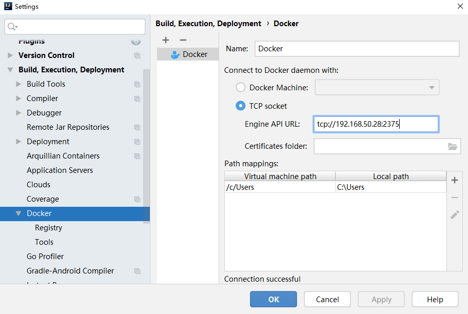
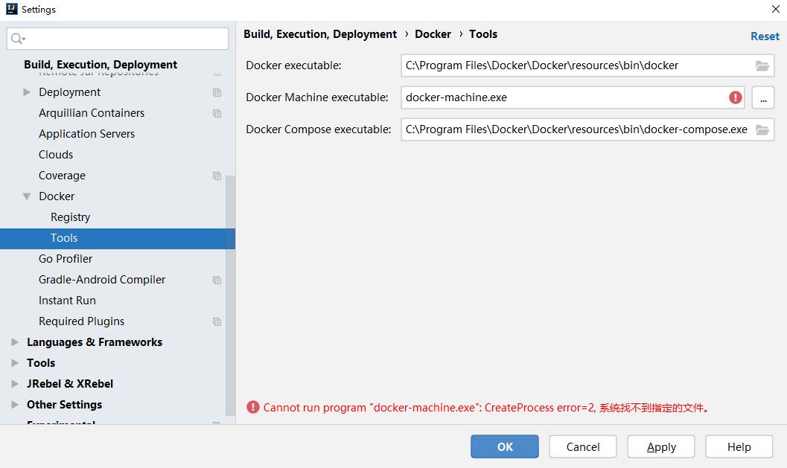
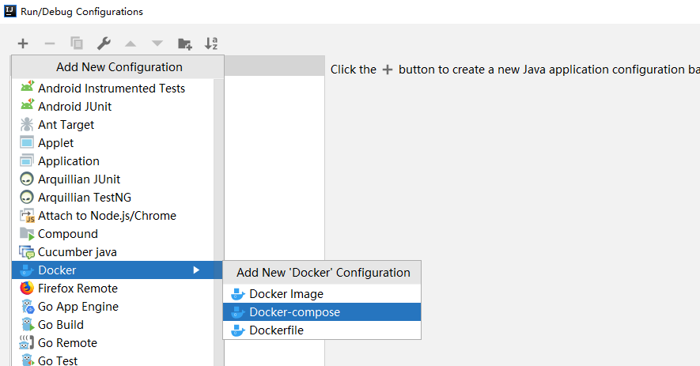

本地环境 Windows10+WSL2(Ubuntu)

在服务器安装 Docker 之后，开启远程访问

 `sudo vi /etc/default/docker` 修改配置

```bash
# 开启远程访问 -H tcp://0.0.0.0:2375
# 开启本地套接字访问 -H unix:///var/run/docker.sock
DOCKER_OPTS="-H tcp://0.0.0.0:2375 -H unix:///var/run/docker.sock"
```

`sudo service docker restart` 重启

Idea 安装 Docker 插件后，设置填写地址 tcp://192.168.50.28:2375 ，成功连接的话有 Connection Successful 提示



Tools 选项配置，需要先安装 Windows 版本 Docker，装完把程序关掉，开机自启关掉，因为我不想多开一个程序，Ubuntu 里已经有 Docker 了，这里只是要用到 docker-compose.exe 在 Windows 环境做下容器编排而已。Docker Machine 用不着也不用管。



一般的 Dockerfile 文件和 docker-compose.yml 文件参考

```bash
FROM ubuntu:latest

COPY target/*.jar /app.jar

ENV JAVA_HOME="/usr/lib/jdk1.8"

ENV PATH="${PATH}:${JAVA_HOME}/bin:${JAVA_HOME}/sbin"

ENTRYPOINT [ "java", "-jar", "/app.jar" ]
```

```bash
version: '3'
services:
  last:
    build:
      context: .
      dockerfile: Dockerfile
    ports:
      - "18080:8080"
    volumes:
      - /usr/lib/jvm/java-8-openjdk-amd64:/usr/lib/jdk1.8 #宿主机 jdk 映射给容器使用
    tty: true
    network_mode: bridge
    restart: always
```

使用 Docker-compose 创建 Docker 容器



Compose files 选择刚创建的 docker-compose.yml 文件

运行

```bash
Deploying 'Compose: lin-test'...
"C:\Program Files\Docker\Docker\resources\bin\docker-compose.exe" -f D:\Project\gitFile\lin\lin-test\docker-compose.yml up -d
Building last
Sending build context to Docker daemon  61.72MB
Step 1/5 : FROM ubuntu:latest
 ---> c29284518f49
Step 2/5 : COPY target/*.jar /app.jar
 ---> f13f1a3f4a0d
Step 3/5 : ENV JAVA_HOME="/usr/lib/jdk1.8"
 ---> Running in ea05d01bf802
Removing intermediate container ea05d01bf802
 ---> 9bb4f1a6be38
Step 4/5 : ENV PATH="${PATH}:${JAVA_HOME}/bin:${JAVA_HOME}/sbin"
 ---> Running in 73ab542794a5
Removing intermediate container 73ab542794a5
 ---> a6d791e7bd7c
Step 5/5 : ENTRYPOINT [ "java", "-jar", "/app.jar" ]
 ---> Running in e1704a59d50b
Removing intermediate container e1704a59d50b
 ---> 8ee7a6f5b53a
Successfully built 8ee7a6f5b53a
Successfully tagged lin-test_last:latest
SECURITY WARNING: You are building a Docker image from Windows against a non-Windows Docker host. All files and directories added to build context will have '-rwxr-xr-x' permissions. It is recommended to double check and reset permissions for sensitive files and directories.

Use 'docker scan' to run Snyk tests against images to find vulnerabilities and learn how to fix them
Image for service last was built because it did not already exist. To rebuild this image you must use `docker-compose build` or `docker-compose up --build`.
Creating lin-test_last_1 ... 
Creating lin-test_last_1 ... done
'Compose: lin-test' has been deployed successfully.
```