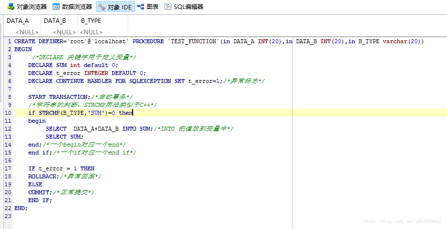
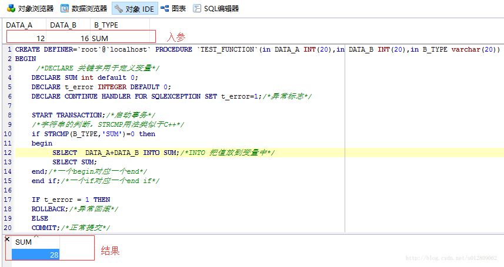
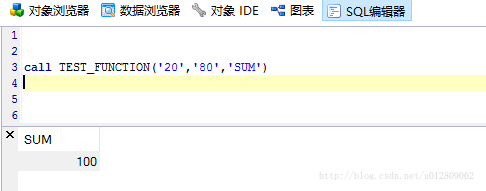

> 当需要实现复杂的逻辑，需要写多条sql语句或写的sql比较复杂时，可以考虑使用存储过程来处理，最终返回需要的结果集。存储过程即一组SQL语句集。

存储过程的基本语法也不算复杂，以下为创建一个存储过程的模板
<!--more-->
```sql
DROP PROCEDURE IF EXISTS TEST_FUNCTION;
/*定义存储过程名称，设置入参，指定类型和大小*/
CREATE PROCEDURE TEST_FUNCTION(in DATA_A INT(20),in DATA_B INT(20),in B_TYPE varchar(20))
BEGIN
     /*DECLARE 关键字用于定义变量*/
    DECLARE SUM int default 0;
    DECLARE t_error INTEGER DEFAULT 0;
    DECLARE CONTINUE HANDLER FOR SQLEXCEPTION SET t_error=1;/*异常标志*/
    
    START TRANSACTION;/*启动事务*/
    /*字符串的判断，STRCMP用法类似于C++*/
    if STRCMP(B_TYPE,'SUM')=0 then
    begin
         SELECT  DATA_A+DATA_B INTO SUM;/*INTO 把值放到变量中*/
         SELECT SUM;
    end;/*一个begin对应一个end*/
    end if;/*一个if对应一个end if*/
    
    IF t_error = 1 THEN  
    ROLLBACK;/*异常回滚*/
    ELSE
    COMMIT;/*正常提交*/
    END IF;
END;
```
创建生成的样子



DEFINER的信息是'用户名'@'host'

输入参数值测试


调用存储使用call命令
