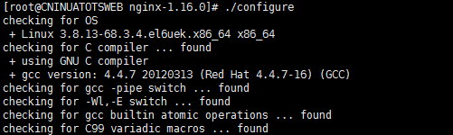

内网的nginx扫出几个漏洞，要求隐藏版本号，解决整型溢出问题，建议升级修补一下。
<!--more-->
先 sudo su 用root权限，查看当前版本，再备份

```
[root@CNINUATOTSWEB nginx-1.16.0]# /usr/local/nginx/sbin/nginx -V
nginx version: nginx/1.10.1
built by gcc 4.4.7 20120313 (Red Hat 4.4.7-16) (GCC)
configure arguments:
```


解压新版本

tar -zxvf nginx-1.16.0.tar.gz

配置参数（configure arguments后面的参数，没有不填）

`./configure`


make 编译（完成之后切记别 make install）


备份旧版本（最重要的 conf文件 记得备份到本地）

mv /usr/local/nginx/sbin/nginx /usr/local/nginx/sbin/nginx.old

复制 objs 下新版到 sbin 目录

cp objs/nginx /usr/local/nginx/sbin/


最后执行 make upgrade 替换老的nginx进程


再执行 nginx -V 查看是否成功


隐藏版本号，编辑 nginx.conf, http 下加上`server_tokens off;`
```
http {
    include       mime.types;
    default_type  application/octet-stream;
    server_tokens off;

    #log_format  main  '$remote_addr - $remote_user [$time_local] "$request" '
    #                  '$status $body_bytes_sent "$http_referer" '
    #                  '"$http_user_agent" "$http_x_forwarded_for"';
.
.
.
#以下略
```

