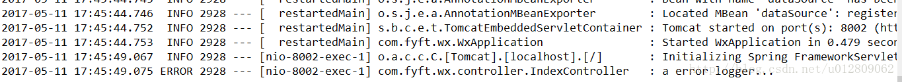

热部署和日志是开发中常用的功能，Srping Boot同样集成了相应的工具，可以方便地实现这些功能。

### 热部署
Spring Boot提供了 `spring-boot-devtools` 模块用于热部署，直接引入就行。<!--more-->
```xml
<dependency>
	<groupId>org.springframework.boot</groupId>
	<artifactId>spring-boot-devtools</artifactId>
	<optional>true</optional>
</dependency>
```

当修改代码重新编译时，工程就会重新启动加载。

### 日志功能
当引入 `spring-boot-starter-web`  时候，Spring Boot已经自动引入 `spring-boot-starter-logging` ，这里我们使用Logback来实现日志管理。Logback是log4j框架的作者开发的新一代日志框架，它效率更高、能够适应诸多的运行环境，同时天然支持SLF4J。

在spring-boot-starter-xx.RELEASE.jar （xx为版本号）下	`org.springframework.boot.logging.logback` 包中可看到一个base.xml文件,这是Spring Boot 的logback的默认配置。内容
```xml
<?xml version="1.0" encoding="UTF-8"?>

<!--
Base logback configuration provided for compatibility with Spring Boot 1.1
-->

<included>
	<include resource="org/springframework/boot/logging/logback/defaults.xml" />
	<property name="LOG_FILE" value="${LOG_FILE:-${LOG_PATH:-${LOG_TEMP:-${java.io.tmpdir:-/tmp}}}/spring.log}"/>
	<include resource="org/springframework/boot/logging/logback/console-appender.xml" />
	<include resource="org/springframework/boot/logging/logback/file-appender.xml" />
	<root level="INFO">
		<appender-ref ref="CONSOLE" />
		<appender-ref ref="FILE" />
	</root>
</included>
```

可以看到日志的输出级别是INFO，输出到文件需要我们东东配置下路径。在application.properties进行配置如下
```xml
#日志配置
logging.file=test.log
logging.level.com.fyft.wx.controller=warn
```
运行会在工程根目录看到生成的日志文件，把`com.fyft.wx.controller` 包的日志级别设置为warn了
controller下写个测试类
```Java
package com.fyft.wx.controller;
import org.slf4j.Logger;
import org.slf4j.LoggerFactory;
import org.springframework.web.bind.annotation.RequestMapping;
import org.springframework.web.bind.annotation.RestController;

@RestController
public class IndexController {
	
	private final static Logger LOG = LoggerFactory.getLogger(IndexController.class);
	
	@RequestMapping("test")
	public String name() {
		LOG.info("a info logger...");
		LOG.error("a error logger...");
		return "welcome to the FYFT index page.I'm shen.";
	}
}
```
访问本controller，输出（日志级别ALL < DEBUG < INFO < WARN < ERROR < FATAL < OFF，所以只输出error的）


如果我们需要更复杂的日志功能，可以自己写一个xml文件来配置，比如输出到控制台使用Spring Boot的默认配置，而输出到文件使用自定义配置。
在resources下新建一个logback.xml配置文件并把刚才logging.file的配置删掉，配置如下
```xml
<?xml version="1.0" encoding="UTF-8"?>
<configuration>
	<!-- 继承默认配置 -->
	<include resource="org/springframework/boot/logging/logback/base.xml"/>
	<logger name="org.springframework.web" level="WARN"/>
	
	<!-- 日志存储路径 -->
	<property name="LOG_HOME" value="D:\\logs" />
	
	<!-- 文件输出配置 -->
	<appender name="FILE" class="ch.qos.logback.core.rolling.RollingFileAppender">
	    <File>${LOG_HOME}\\fyft-wx.log</File>
	    <rollingPolicy class="ch.qos.logback.core.rolling.TimeBasedRollingPolicy">
	        <!-- daily rollover 保存历史记录到这个文件夹一日起为后缀 -->
		    <FileNamePattern>${LOG_HOME}\\temp\\fyft-wx.%d{yyyy-MM-dd}.%i.log</FileNamePattern>
		    <!-- keep 30 days' worth of history 保存天数-->
		    <maxHistory>30</maxHistory>
		    <!-- 日志大小 -->
		    <timeBasedFileNamingAndTriggeringPolicy class="ch.qos.logback.core.rolling.SizeAndTimeBasedFNATP">
                <maxFileSize>2MB</maxFileSize>
            </timeBasedFileNamingAndTriggeringPolicy>
		</rollingPolicy>
		<encoder>
			<!--格式化输出：%d表示日期，%thread表示线程名，%-5level：级别从左显示5个字符宽度%msg：日志消息，%n是换行符-->
		    <Pattern>%d{yyyy-MM-dd HH:mm:ss.SSS} [%thread] %-5level %logger{35} - %msg %n</Pattern>
		    <charset>UTF-8</charset> <!-- 此处设置字符集 -->
	    </encoder>
	</appender>

	<!-- root节点，配置日志级别，添加输出节点 -->
	<root level="INFO">
	    <appender-ref ref="FILE"></appender-ref>
	</root>
</configuration>
```

如果输出到控制台的日志也需要自定义，就再加上一个 appender 配置，并添加到root节点。需要注意的是继承自 Spring Bootd 配置需要去掉，不然控制台的日志会输出两次（logger输出一次，root输出一次）

```xml
<?xml version="1.0" encoding="UTF-8"?>
<configuration>  
	<!-- 去掉继承的配置 -->
	<!-- <include resource="org/springframework/boot/logging/logback/base.xml"/>
	<logger name="org.springframework.web" level="WARN"/> -->
	
	<!-- 日志存储路径 -->
	<property name="LOG_HOME" value="D:\\logs" />
	
	<!-- 文件输出配置 -->
	<appender name="FILE" class="ch.qos.logback.core.rolling.RollingFileAppender">
	    <File>${LOG_HOME}\\fyft-wx.log</File>
	    <rollingPolicy class="ch.qos.logback.core.rolling.TimeBasedRollingPolicy">
	        <!-- daily rollover 保存历史记录到这个文件夹一日起为后缀 -->
		    <FileNamePattern>${LOG_HOME}\\temp\\fyft-wx.%d{yyyy-MM-dd}.%i.log</FileNamePattern>
		    <!-- keep 30 days' worth of history 保存天数-->
		    <maxHistory>30</maxHistory>
		    <!-- 日志大小 -->
		    <timeBasedFileNamingAndTriggeringPolicy class="ch.qos.logback.core.rolling.SizeAndTimeBasedFNATP">
                <maxFileSize>2MB</maxFileSize>
            </timeBasedFileNamingAndTriggeringPolicy>
		</rollingPolicy>
		<encoder>
			<!--格式化输出：%d表示日期，%thread表示线程名，%-5level：级别从左显示5个字符宽度%msg：日志消息，%n是换行符-->
		    <Pattern>%d{yyyy-MM-dd HH:mm:ss.SSS} [%thread] %-5level %logger{35} - %msg %n</Pattern>
		    <charset>UTF-8</charset> <!-- 此处设置字符集 -->
	    </encoder>
	</appender>
	
	<!-- 控制台输出配置 -->   
    <appender name="STDOUT" class="ch.qos.logback.core.ConsoleAppender">
        <encoder class="ch.qos.logback.classic.encoder.PatternLayoutEncoder"> 
            <!--格式化输出：%d表示日期，${PID} 进程Id， %thread表示线程名，%-5level：级别从左显示5个字符宽度%msg：日志消息，%n是换行符--> 
            <Pattern>%d{yyyy-MM-dd HH:mm:ss.SSS} ${PID} [%thread] %-5level %logger{35} - %msg %n</Pattern>
            <charset>UTF-8</charset> <!-- 此处设置字符集 -->
        </encoder> 
    </appender>
	
	<!-- root节点，配置日志级别，添加输出节点 -->
	<root level="INFO">
	    <appender-ref ref="FILE"></appender-ref>
	    <appender-ref ref="STDOUT"></appender-ref>
	</root>
</configuration>
```
其他更多详细的logback配置可查看官方文档 https://logback.qos.ch/manual/configuration.html