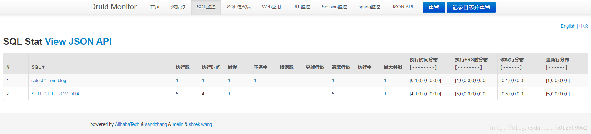
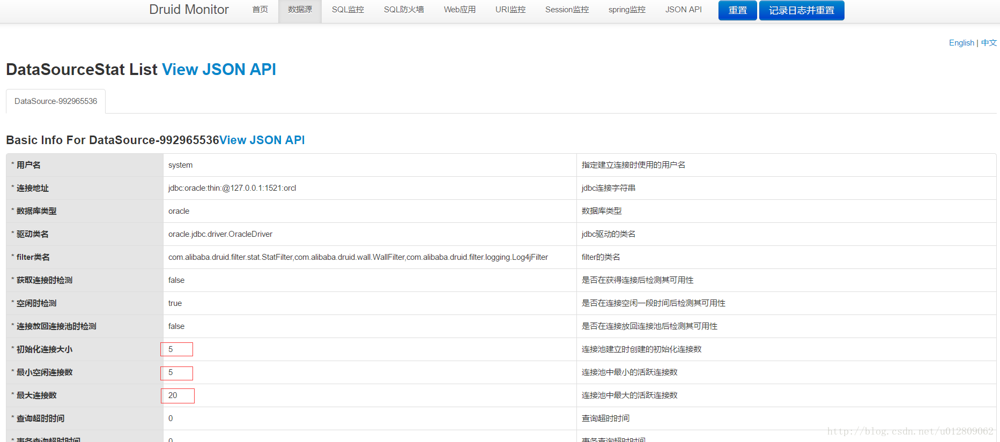

Druid是阿里巴巴开源平台上的一个项目,整个项目由数据库连接池、插件框架和SQL解析器组成。

### 添加Druid数据源
要使用Druid数据源，我们需要在 application.properties 下添加配置信息<!--more-->
```xml
#数据库访问配置
#mysql
#spring.datasource.type=com.alibaba.druid.pool.DruidDataSource
#spring.datasource.driver-class-name=com.mysql.jdbc.Driver
#spring.datasource.url=jdbc:mysql://localhost:3306/blog
#oracle
spring.datasource.driverClassName=oracle.jdbc.driver.OracleDriver
spring.datasource.url=jdbc:oracle:thin:@127.0.0.1:1521:orcl
spring.datasource.username=system
spring.datasource.password=123456

#连接池配置
spring.datasource.initialSize=5
spring.datasource.minIdle=5
spring.datasource.maxActive=20
#连接等待超时时间
spring.datasource.maxWait=60000
#配置隔多久进行一次检测(检测可以关闭的空闲连接)
spring.datasource.timeBetweenEvictionRunsMillis=60000
#配置连接在池中的最小生存时间
spring.datasource.minEvictableIdleTimeMillis=300000
spring.datasource.validationQuery=SELECT 1 FROM DUAL
spring.datasource.testWhileIdle=true
spring.datasource.testOnBorrow=false
spring.datasource.testOnReturn=false
# 打开PSCache，并且指定每个连接上PSCache的大小
spring.datasource.poolPreparedStatements=true
spring.datasource.maxPoolPreparedStatementPerConnectionSize=20
# 配置监控统计拦截的filters，去掉后监控界面sql无法统计，'wall'用于防火墙
spring.datasource.filters=stat,wall,log4j
# 通过connectProperties属性来打开mergeSql功能；慢SQL记录
spring.datasource.connectionProperties=druid.stat.mergeSql=true;druid.stat.slowSqlMillis=5000
```

上面提供了mysql和oracle两种数据库驱动的配置，由于maven中心仓库不提供oracle驱动，需要到oracle官网自行下载你自己版本需要的oracle数据库驱动，再安装到本地仓库。我这里用的eclipse自带的maven，安装oracle数据库驱动到本地仓库是直接建个文件夹丢进去重命下名的，简单粗暴。

参考：jar包放com/oracle/ojdbc6/10.2.0.1.0 文件夹下，命名ojdbc6-10.2.0.1.0.jar
```xml
<dependency>
   <groupId>com.oracle</groupId>
   <artifactId>ojdbc6</artifactId>
   <version>${ojdbc6.version}</version>
</dependency>
```

此外，在本版本（1.5.2）的Spring Boot 中，对于上面Druid连接池的配置都不支持，意味着这些配置属性不会生效，所以，需要些一个配置类来读取这些配置并设置到数据源中去

```java
package com.fyft.wx.config;

import java.sql.SQLException;
import javax.sql.DataSource;
import org.slf4j.Logger;
import org.slf4j.LoggerFactory;
import org.springframework.beans.factory.annotation.Value;
import org.springframework.boot.autoconfigure.jdbc.DataSourceProperties;
import org.springframework.context.annotation.Bean;
import org.springframework.context.annotation.Configuration;
import org.springframework.context.annotation.Primary;
import com.alibaba.druid.pool.DruidDataSource;

/**
 *<p>Title: DruidDataSourceConfig.java</p>
 *<p>Description: 数据源属性配置</p>
 *<p>CreateDate: 2017年5月18日</p>
 *@author shen
 *@version v1.0
 */
@Configuration
@Primary //在同样的DataSource中，首先使用被标注的DataSource
public class DruidDataSourceConfig extends DataSourceProperties{
	
	private Logger logger = LoggerFactory.getLogger(DruidDataSourceConfig.class);
	
	@Value("${spring.datasource.url}")  
    private String dbUrl;  
      
    @Value("${spring.datasource.username}")  
    private String username;  
      
    @Value("${spring.datasource.password}")  
    private String password;  
      
    @Value("${spring.datasource.driverClassName}")  
    private String driverClassName;  
      
    @Value("${spring.datasource.initialSize}")  
    private int initialSize;  
      
    @Value("${spring.datasource.minIdle}")  
    private int minIdle;  
      
    @Value("${spring.datasource.maxActive}")  
    private int maxActive;  
      
    @Value("${spring.datasource.maxWait}")  
    private int maxWait;  
      
    @Value("${spring.datasource.timeBetweenEvictionRunsMillis}")  
    private int timeBetweenEvictionRunsMillis;  
      
    @Value("${spring.datasource.minEvictableIdleTimeMillis}")  
    private int minEvictableIdleTimeMillis;  
      
    @Value("${spring.datasource.validationQuery}")  
    private String validationQuery;  
      
    @Value("${spring.datasource.testWhileIdle}")  
    private boolean testWhileIdle;  
      
    @Value("${spring.datasource.testOnBorrow}")  
    private boolean testOnBorrow;  
      
    @Value("${spring.datasource.testOnReturn}")  
    private boolean testOnReturn;  
      
    @Value("${spring.datasource.poolPreparedStatements}")  
    private boolean poolPreparedStatements;  
      
    @Value("${spring.datasource.maxPoolPreparedStatementPerConnectionSize}")  
    private int maxPoolPreparedStatementPerConnectionSize;  
      
    @Value("${spring.datasource.filters}")  
    private String filters;  
      
    @Value("{spring.datasource.connectionProperties}")  
    private String connectionProperties;  
      
    @Bean     //声明其为Bean实例  
    public DataSource dataSource(){  
        DruidDataSource datasource = new DruidDataSource();  
          
        datasource.setUrl(this.dbUrl);  
        datasource.setUsername(username);  
        datasource.setPassword(password);  
        datasource.setDriverClassName(driverClassName);  
          
        //configuration  
        datasource.setInitialSize(initialSize);  
        datasource.setMinIdle(minIdle);  
        datasource.setMaxActive(maxActive);  
        datasource.setMaxWait(maxWait);  
        datasource.setTimeBetweenEvictionRunsMillis(timeBetweenEvictionRunsMillis);  
        datasource.setMinEvictableIdleTimeMillis(minEvictableIdleTimeMillis);  
        datasource.setValidationQuery(validationQuery);  
        datasource.setTestWhileIdle(testWhileIdle);  
        datasource.setTestOnBorrow(testOnBorrow);  
        datasource.setTestOnReturn(testOnReturn);  
        datasource.setPoolPreparedStatements(poolPreparedStatements);  
        datasource.setMaxPoolPreparedStatementPerConnectionSize(maxPoolPreparedStatementPerConnectionSize);  
        try {  
            datasource.setFilters(filters);  
        } catch (SQLException e) {  
            logger.error("druid configuration initialization filter", e);  
        }  
        datasource.setConnectionProperties(connectionProperties);  
          
        return datasource;  
    }
}
```
本段配置参考自 http://blog.csdn.net/blueheart20/article/details/52384032
其中 @Primary 注解需要放在类上，不然本类配置还是不会覆盖默认的数据源配置，原作者是放在 `public DataSource dataSource()` 方法上，会报存在两个配置的错误，估计是Spring Boot版本的差异问题。

### 配置监控统计功能

新建一个配置类
```java
package com.fyft.wx.config;

import org.springframework.boot.web.servlet.FilterRegistrationBean;
import org.springframework.boot.web.servlet.ServletRegistrationBean;
import org.springframework.context.annotation.Bean;
import org.springframework.context.annotation.Configuration;
import com.alibaba.druid.support.http.StatViewServlet;
import com.alibaba.druid.support.http.WebStatFilter;

/**
 *<p>Title: DruidConfiguration.java</p>
 *<p>Description: Druid监控配置</p>
 *<p>CreateDate: 2017年5月3日</p>
 *@author shen
 *@version v1.0
 */

@Configuration
public class DruidMonitorConfig {
	
	/**
     * 注册ServletRegistrationBean
     * @return
     */
    @Bean
    public ServletRegistrationBean registrationBean() {
        ServletRegistrationBean bean = new ServletRegistrationBean(new StatViewServlet(), "/druid/*");
        /** 初始化参数配置，initParams**/
        //白名单
        bean.addInitParameter("allow", "127.0.0.1");//多个ip逗号隔开
        //IP黑名单 (存在共同时，deny优先于allow) : 如果满足deny的话提示:Sorry, you are not permitted to view this page.
        //bean.addInitParameter("deny", "192.168.1.73");
        //登录查看信息的账号密码.
        bean.addInitParameter("loginUsername", "admin");
        bean.addInitParameter("loginPassword", "123456");
        //是否能够重置数据.
        bean.addInitParameter("resetEnable", "false");
        return bean;
    }

    /**
     * 注册FilterRegistrationBean
     * @return
     */
    @Bean
    public FilterRegistrationBean druidStatFilter() {
        FilterRegistrationBean bean = new FilterRegistrationBean(new WebStatFilter());
        //添加过滤规则.
        bean.addUrlPatterns("/*");
        //添加不需要忽略的格式信息.
        bean.addInitParameter("exclusions","*.js,*.gif,*.jpg,*.png,*.css,*.ico,/druid/*");
        return bean;
    }
    
}

```
启动项目后访问 ip:端口/druid 输入配置类设置的账号密码进入监控后台。我们先执行一个数据库操作，可以在sql监控选项卡看到执行的sql


查看数据源选项卡可以看到配置连接池参数也都生效了
