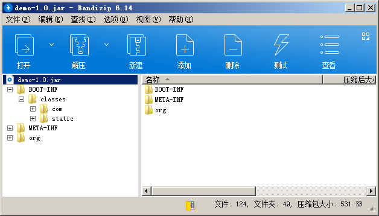

SpringBoot 工程若用简单的 `clean package` 命令打包会包含所有依赖 jar 包，如果工程依赖比较多的时候，打的包通常动不动就几十 m 大。这使得在部署到远程的时候，如果你的网络是小水管的就要传半天了，而且上微服务的项目，多个工程，一个工程还多台机器，更新部署需要浪费许多时间。

SpringBoot 启动可以以加载外部依赖目录来启动工程，所以我不必每次打包都包含一堆 jar 包，只需要把 jar 统一放一个目录，启动时指定依赖目录启动就行。

在网上搜索各类资料和博客，大多以下方式打包。
以 maven 打包为例，使用 SpringBoot 打包插件先正常打包
```xml
<build>
    <plugins>
        <plugin>
            <groupId>org.springframework.boot</groupId>
            <artifactId>spring-boot-maven-plugin</artifactId>
            <configuration>
                <layout>ZIP</layout>
                <includes>
                    <!-- 依赖变化去掉打包重新传完jar包后再打开打包 -->
                    <!-- <include>
                        <groupId>nothing</groupId>
                        <artifactId>nothing</artifactId>
                    </include> -->
                </includes>
            </configuration>
        </plugin>
    </plugins>

    <resources>
        <resource>
            <directory>src/main/resources</directory>
            <includes>
                <include>**/**</include>
            </includes>
            <filtering>false</filtering>
        </resource>
    </resources>
</build>
```

打包后的目录结构，将 lib 目录的依赖包拷贝出来上传到服务器，依赖一般很少改动，若依赖改变重新传一次


 打开 include nothing 的配置注释重新打包
 ```xml
<include>
    <groupId>nothing</groupId>
    <artifactId>nothing</artifactId>
</include>
 ```

打包后的文件，很小了，不用每次部署都传大文件


另外也可以直接用 maven maven-dependency-plugin 插件直接把 jar 包拷贝到目标目录，不需要去包里拷贝，更直接
```xml
<build>
    <plugins>
        <plugin>
            <groupId>org.springframework.boot</groupId>
            <artifactId>spring-boot-maven-plugin</artifactId>
            <configuration>
                <layout>ZIP</layout>
                <includes>
                    <!-- 不含依赖 -->
                    <include>
                        <groupId>nothing</groupId>
                        <artifactId>nothing</artifactId>
                    </include>
                </includes>
            </configuration>
        </plugin>
        
        <!-- 拷贝依赖jar包到target/lib -->
        <plugin>
            <groupId>org.apache.maven.plugins</groupId>
            <artifactId>maven-dependency-plugin</artifactId>
            <executions>
                <execution>
                <id>copy-dependencies</id>
                <phase>package</phase>
                <goals>
                    <goal>copy-dependencies</goal>
                </goals>
                <configuration>
                    <type>jar</type>
                    <includeTypes>jar</includeTypes>
                    <includeScope>runtime</includeScope>
                    <outputDirectory>
                    ${project.build.directory}/lib
                    </outputDirectory>
                </configuration>
                </execution>
            </executions>
        </plugin>
    </plugins>

    <resources>
        <resource>
            <directory>src/main/resources</directory>
            <includes>
                <include>**/**</include>
            </includes>
            <filtering>false</filtering>
        </resource>
    </resources>
</build>
```
启动指定 lib 目录，`java -Dloader.path=/app/demo/lib -jar demo-*.jar`
以发行包和 lib 依赖目录都在 /app/demo 目录下为例，启动的参考脚本，jvm 及其他参数自行加上，注意你的进程名，别把其他进程也 kill 了
```bash
#!/bin/sh

workdir=/app/demo

start() {
    cd $workdir
	nohup  java -Dloader.path="lib/" -Xms512m -Xmx1024m -jar demo-*.jar  > demo.out 2>&1 &
    echo "demo service has started."
}

stop() {
    pid=`ps -ef | grep  'demo-' | grep -v grep | awk '{ print $2 }'`
    echo $pid
    kill -9 $pid
    echo "demo service has stoped."
}

case "$1" in
	start)
	start
	  ;;
	stop)
	stop
	;;
	restart)
	stop
	start
	;;
  *)
	echo "Usage: ./demo.sh {start|stop|restart}"
	exit 1
esac

exit 0

```
保存为 `demo.sh`
授权755 `chmod 755 demo.sh`
启动 `./demo.sh start`
查看日志输出 `tail -20f /app/demo/demo.out`
