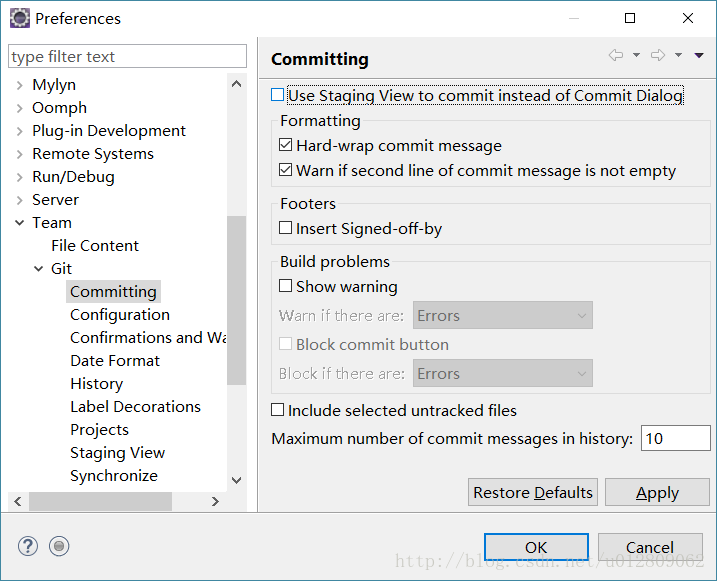

eclipse neon 版本更新了git工具EGit版本，默认commit时使用的是一个标签窗口，不是像之前一个新 dialog窗口，像下面这样： 

不能单独作为新窗口拖出来的，个人用起来也觉得操作真的是不方便，翻了下设置，在Window-Preferences-Team-Git-Committing可以看到第一个选项 Use Staging View … （使用staging代替原来dialog的commit视图），把这个打钩去掉提交界面就回到前版本的样子 

