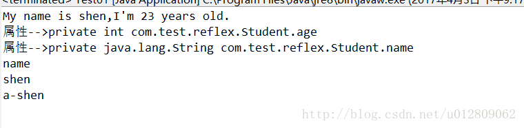
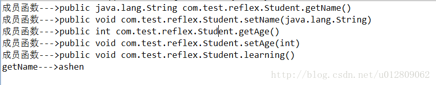

> 相信大家经常听说某些框架设计用到了反射机制啥啥，但自己对此概念却了解甚少，虽然一般开发不会用到，但还是有必要知道反射的基本原理和操作。

  使用反射，可以做到：

*  在运行中分析类的能力。
*  在运行中查看对象，例如，编写一个toString方法供所有类使用。
* 实现数组的操作代码。
* 利用Method对象，这个对象很像C++中的函数指针。

反射操作主要用到的类有Class（类）、Field（属性）、Method（成员函数）、Constructor（构造）和Modifier（修饰符）
<!--more-->
一、反射获取类

新建一个Student类
```java
public class Student {

	private int age;
	private String name;
	
	//无参构造
	public Student() {
		
	}
	
	//有参构造
	public Student(int age, String name){
		this.age = age;
		this.name = name;
		System.out.println("My name is "+name+",I'm "+age+" years old.");
	}
	
	public void setAge(int age) {
		this.age = age;
	}
	public void setName(String name) {
		this.name = name;
	}
	
	public int getAge() {
		return age;
	}
	public String getName() {
		return name;
	}
	
	public void learning() {
		System.out.println("learning...");
	}
	
}
```
测试类
```
public class ReflexTest {
	public static void main(String[] args) throws ClassNotFoundException {
		Student student = new Student(20, "shen");//一般创建对象
		
		Class stu = Class.forName("com.test.reflex.Student");//通过Class获取指定类的完整结构
		System.out.println("getName--->"+stu.getName());
		
		Student s = null;
		Student s1 = null; 
		try {
			s = (Student)stu.newInstance();//默认构造的是无参构造，若存在有参构造，这里将报错
			
			Constructor constructor = stu.getConstructor(int.class, String.class);//获取有参构造,已知确定参数
			s1 = (Student)constructor.newInstance(23, "shen");//有参构造
			
			Constructor[] constructors = stu.getConstructors();//所有构造
			s1 = (Student)constructors[0].newInstance();//第一个构造(无参那个)
		} catch (Exception e) {
			e.printStackTrace();
		}
		
	}
}
```
输出：

Class类forName方法通过完整包路径类型来实例化Class对象，再通过Class对象获取Student类实例；
再使用newInstance()创建对象，这里要注意Student的构造方法，默认使用的试试无参构造，可使用Constructor类操作构造方法。

二、获取类的基本结构

1、使用反射操作对象属性
```
public class Test01 {
	public static void main(String[] args) throws Exception, Exception {
		try {
			Class stu = Class.forName("com.test.reflex.Student");
			
			Constructor constructor = stu.getConstructor(int.class, String.class);//获取有参构造,已知确定参数
			Student s = (Student)constructor.newInstance(23, "shen");//有参构造
			
			//Field[] fields = stu.getFields();//获取public的属性
			Field[] fields = stu.getDeclaredFields();//获取所有属性
			for(Field field : fields){
				System.out.println("属性-->"+field);
			}
			
			Field fieldName = stu.getDeclaredField("name");//获取私有变量name
			fieldName.setAccessible(true);
			System.out.println(fieldName.getName());//私有属性名称
			System.out.println(fieldName.get(s));//私有属性值
			
			fieldName.set(s, "a-shen");
			System.out.println(fieldName.get(s));//改变私有属性值
			
		} catch (ClassNotFoundException e) {
			e.printStackTrace();
		}
		
	}
}
```
结果输出


其中对于fieldName.setAccessible(true);使用java反射获取类的属性值时，如果该属性被声明为private 的，需要将setAccessible设置为true. 默认的值为false

2、使用反射访问成员函数
通过反射调用方法，使用invoke方法

```
public class Test02 {
	public static void main(String[] args) throws Exception, Exception {
		try {
			Class stu = Class.forName("com.test.reflex.Student");
			
			Constructor constructor = stu.getConstructor(int.class, String.class);//获取有参构造,已知确定参数
			Constructor[] constructors = stu.getConstructors();
			Student s = (Student)constructors[0].newInstance();//无参构造对象
			
			//Method[] methods = stu.getMethods();//获取类所有方法，包括继承自父类和实现接口的方法
			Method[] methods = stu.getDeclaredMethods();//获取类本身各类方法和实现接口的方法及重写的方法，不包括继承的方法
			for(Method method : methods){
				System.out.println("成员函数--->"+method);
			}
			
			Method m1 = s.getClass().getMethod("setName", String.class);
			m1.invoke(s, "ashen");//设置name值为"ashen"
			
			Method m2 = s.getClass().getMethod("getName");
			String name = (String) m2.invoke(s);
			System.out.println("getName--->"+name);//输出name值
			
		}catch (ClassNotFoundException e) {
			e.printStackTrace();
		}
		
	}
}
```
结果输出
