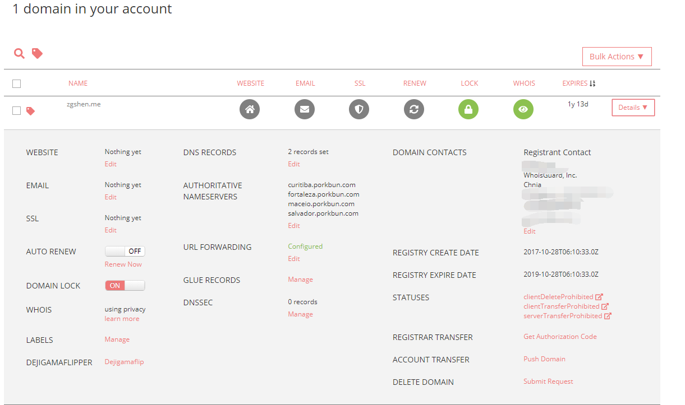

域名不论是新注册、续费和转移，不同的注册商的定价和提供的服务都不一样。有些注册商对新注册域名有比较大的优惠，但续费的就不是那么便宜，还好域名是可以转移到别的注册商，所以给我们的选择就比较多了。<!--more-->

#### 一般在哪个注册商注册域名考虑的方面有：  
价格：要快速知道各注册商的域名定价，可以到一些域名比较网站看看，比如 `www.domcomp.com` ；  
备案情况：许多人建博客喜欢用 `.me、.im` 域名，但这些域名现在国内是无法备案的，所以只能选择国外的注册商；  
whois ：不少注册商都有提供免费的 whois 隐私保护功能；  
dns ：域名解析功能，不同注册商也有所区别。例如这次我从 Namecheap 转到 Porkbun ，Porkbun 并没有找到二级域名重定向到顶级域名功能，比如把 www 定向到顶级域名，只支持重定向到另一个域名。

#### 一般域名的转移步骤都是一样的：  
首先原注册商解锁域名，停掉 whois ；  
然后就是 transfer 操作了，注册商会给你生成一个转让授权码；  
接着到新的注册商进行转入，需要用到原注册商授权码；  
最后一般等个5天，如果原注册商一直没确认，你的域名就会就会自动转到新的注册商，当然有的注册商有给你转出同意的选择就比较快。所以照这个时间，转移域名一般在到期前的一周操作就行。

这次 transfer 只买了一年，选择了 Porkbun 。

